# LARA — 7-Session Implementation Reference

**LARA — Campus AI Work Station**

| Field | Value |
| --- | --- |
| Document type | Implementation blueprint (engineering reference) |
| Status | Pre-implementation, Session 1 not started |
| Source of truth | `AI_Workstation_PRD.md` (Version 1.0, Scope Freeze) |
| Relationship to PRD | Derivative. This document restates, sequences, and operationalizes the PRD. It does not override it. |
| Execution structure | Seven sequential, gated sessions |
| Audience | The implementing engineer, working alone, session by session |
| Production target | Windows 11 + WSL2 + Docker + NVIDIA RTX 5060 Ti 16 GB |
| Production runtime | Dockerized vLLM |
| Development runtime | Existing local Ollama 0.16.3 installation (temporary) |
| Hard cost constraint | Zero mandatory recurring cost |

---

## 0. How To Read This Document

### 0.1 Purpose

This document is the engineering blueprint used while building LARA. A competent engineer should be able to open it at Session 1 and work through to Session 7 without rediscovering the architecture, re-deriving the data model, or re-deciding the security boundary.

It is not a second PRD. It is not an architecture essay. Every section is written to be executed against.

### 0.2 Notation legend

These five labels appear throughout and carry precise meaning. They must be preserved and extended as implementation proceeds.

| Label | Meaning | Engineer's obligation |
| --- | --- | --- |
| **PRD REQUIREMENT** | Comes directly from `AI_Workstation_PRD.md`. | Do not change without amending the PRD. |
| **ENGINEERING RECOMMENDATION** | A design choice made in this document, not mandated by the PRD. | May be changed with justification. Record the change. |
| **UNKNOWN — MUST BE VERIFIED** | A fact this document deliberately refuses to guess. | Verify against the real environment or current vendor documentation before depending on it. |
| **NOT YET MEASURED** | A number that only exists after running something on real hardware. | Measure, then record the value and the date in `docs/benchmarks/`. |
| **MUST BE BENCHMARKED ON PRODUCTION HARDWARE** | Stronger form of the above: the development machine cannot answer it. | Only the RTX 5060 Ti workstation produces a valid result. |
| **Engineering Note / Potential Revision** | A genuine architectural concern found while writing this blueprint. | Read before implementing the affected session. Escalate rather than silently redesign. |

### 0.3 Rules this document follows

1. No model name is invented. The production model is selected by benchmark, not by this document.
2. No performance number is invented. No tokens/sec, no VRAM figure, no TTFT, no concurrency result.
3. No free-tier limit is invented. Service plan capabilities are verified at implementation time.
4. No hardware specification is invented beyond the PRD table.
5. Where the PRD is silent and a decision is required to proceed, the decision is made explicitly and labelled `ENGINEERING RECOMMENDATION`.
6. Where a requirement looks operationally risky, it is flagged as `Engineering Note / Potential Revision` and left intact.

### 0.4 What this document deliberately excludes

Application source code. This blueprint specifies interfaces, schemas, configuration, state machines, and acceptance criteria. Code is written during the sessions, against this specification.

---

## 1. System Definition

### 1.1 Definition

LARA is a self-hosted, API-first, agentic coding inference platform running on a privately controlled workstation. Authenticated users reach local LLM inference through an OpenAI-compatible HTTP API. Coding agents and repositories stay on user machines. LARA supplies inference and nothing else.

### 1.2 Responsibility boundary

**PRD REQUIREMENT** (PRD 6.1, 6.4, 6.5, 18 Appendix D).

| LARA provides | LARA never provides |
| --- | --- |
| OpenAI-compatible inference endpoints | A remote development environment |
| Authentication and per-user API keys | Shell, Docker, or WSL access to students |
| Queueing, priority, concurrency control | Repository hosting or repository mounts |
| Operating-mode resource policy | Server-side tool execution or code execution |
| Telemetry, analytics, leaderboard | Database or model-filesystem access |
| Secure remote transport (V2) | Commercial model APIs of any kind |

The user's laptop keeps the source code, the Git history, the terminal, the compiler, the test runner, and the coding agent. The agent decides what context to send. LARA sees only what the agent sends, and by default stores none of it.

### 1.3 Design principles carried forward

**PRD REQUIREMENT** (PRD 1.3). These are binding on every session.

1. API first.
2. Agent first, chatbot second.
3. Private by default.
4. No direct exposure of the inference runtime.
5. No artificial daily token quota.
6. Three active inference jobs maximum initially.
7. Queue rather than reject ordinary contention.
8. Configurable priorities from the beginning.
9. Models are replaceable.
10. Transport is replaceable.
11. Student repositories remain on student machines.
12. Everything practical is Dockerized.
13. Do not over-engineer for hypothetical scale.
14. Use real measurements to tune GPU behavior.

### 1.4 Diagram 1: overall architecture

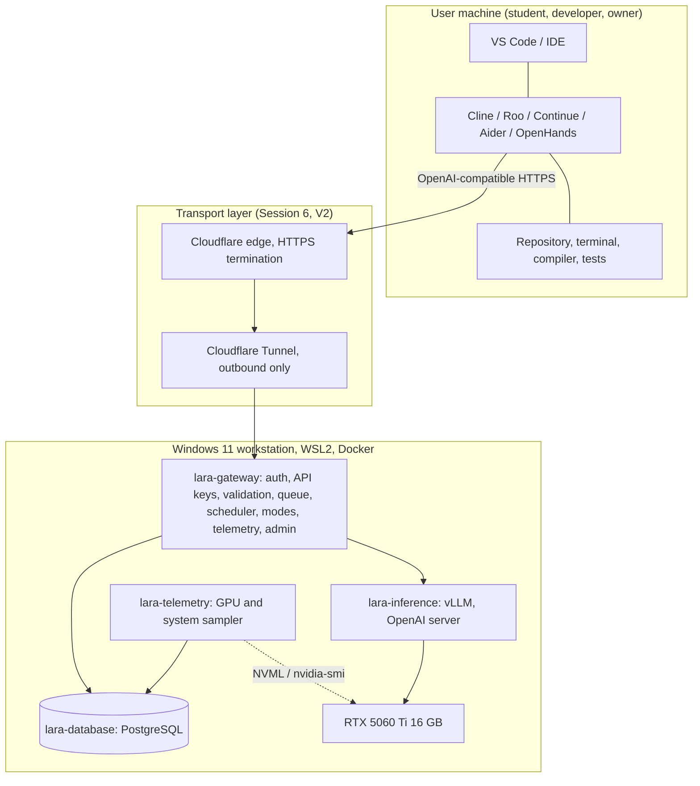

`lara-gateway` is the only component reachable from outside the host. Everything else lives on a private Docker network.

---

## 2. Hardware, Environments, and the Constraint Model

### 2.1 Production hardware

**PRD REQUIREMENT** (PRD 3.1). Treat this as the production target.

| Component | Specification | Notes |
| --- | --- | --- |
| GPU | NVIDIA GeForce RTX 5060 Ti | Use this exact label. The informal "5060 Ti Super" name is wrong and must not appear anywhere in the repository. |
| VRAM | 16 GB class, approximately 16,311 MiB reported | The primary and dominant constraint. |
| CPU | AMD Ryzen 7 8745HX | 8 cores / 16 logical processors. |
| RAM | 64 GB DDR5, 2 x 32 GB | Not a constraint at this scale. |
| Storage | Not currently a constraint | Model cache and logs still need a budget. See section 3.4. |
| Host OS | Windows 11 | WSL2 is the Linux layer. |
| Network | University Wi-Fi | No inbound routing may be assumed. |
| Availability | Intended 24/7, subject to power and network | Restart policies and recovery testing are mandatory. |
| Driver version | UNKNOWN — MUST BE VERIFIED | Record `nvidia-smi` output in Session 1. |
| CUDA version visible to WSL2 | UNKNOWN — MUST BE VERIFIED | Record in Session 1. |

### 2.2 Engineering Note / Potential Revision: GPU generation and runtime support

The RTX 50-series is a newer GPU generation than the RTX 40-series, and new GPU architectures historically require a minimum CUDA toolkit version, a minimum driver version, and a PyTorch build compiled with kernels for that architecture. Prebuilt inference-runtime container images sometimes lag a new architecture by weeks or months.

All of the following are **UNKNOWN — MUST BE VERIFIED** at implementation time, against current official documentation and against the actual machine:

1. The compute capability reported by the installed driver for this specific card.
2. The minimum NVIDIA driver version required on Windows 11 for CUDA under WSL2 on this card.
3. The minimum CUDA runtime version required.
4. Which published vLLM container image tag contains kernels built for this GPU architecture.
5. Which quantization kernels (AWQ, GPTQ, FP8, bitsandbytes, and others) are actually supported on this architecture by the pinned vLLM version.

**This is the single highest-risk unknown in the entire project.** It is concentrated in Session 2 and it is the reason Session 1 exists as a separate gated session. If the pinned vLLM image does not support the GPU, the fallback options, in order of preference, are: pin a newer vLLM image; build vLLM from source against a matching CUDA/PyTorch; or, as a documented temporary measure only, keep the Ollama development backend in place while the gateway work proceeds. The fallback must never become the production architecture (see section 2.6).

### 2.3 The VRAM budget model

**PRD REQUIREMENT** (PRD 3.3, 10.2, Appendix D rule 7): do not assume a model is safe merely because its weights fit.

Total VRAM is shared. Model this explicitly rather than by intuition.

| Consumer | Inside the vLLM pool? | Sizing driver | Value |
| --- | --- | --- | --- |
| Windows desktop, compositor, browser | No | Always present, varies with what is on screen | NOT YET MEASURED |
| Game engine (Unity / Unreal) editor and play mode | No | Scene and editor dependent, can be large and spiky | NOT YET MEASURED |
| Other GPU workloads on the workstation | No | Situational | NOT YET MEASURED |
| CUDA context and runtime overhead per process | Partly | Fixed cost per process | NOT YET MEASURED |
| Model weights | Yes | Parameter count x bytes per parameter after quantization | NOT YET MEASURED |
| KV cache | Yes | Context length x concurrent sequences x model KV geometry | NOT YET MEASURED |
| Activation and scratch memory | Yes | Batch and sequence dependent | NOT YET MEASURED |

Three consequences that shape the whole design:

1. **vLLM preallocates.** vLLM reserves a fraction of GPU memory at startup and manages KV cache inside that reservation. The exact semantics of the memory-fraction argument for the pinned version are **UNKNOWN — MUST BE VERIFIED**. The practical implication is that LARA's VRAM footprint is decided at inference-container start, not per request.
2. **KV cache, not weights, sets the concurrency ceiling.** Three concurrent agentic requests at long context can require substantially more KV cache than three short chat requests. The 3-job ceiling is therefore a starting policy, and the context caps that make it safe are **MUST BE BENCHMARKED ON PRODUCTION HARDWARE**.
3. **Game Dev Mode cannot shrink a running pool.** See section 5.3 and Session 5 for the consequence.

### 2.4 Development environment

The developer's current machine has:

```text
Ollama 0.16.3
```

The model installed on that machine is **UNKNOWN — MUST BE VERIFIED**. It must be discovered from the real environment, never assumed:

```bash
ollama list
ollama show <model-name>
curl http://localhost:11434/v1/models
```

Only discovered values may be written into `docs/` or into the model registry seed data.

### 2.5 Diagram 8: Ollama development architecture (temporary)

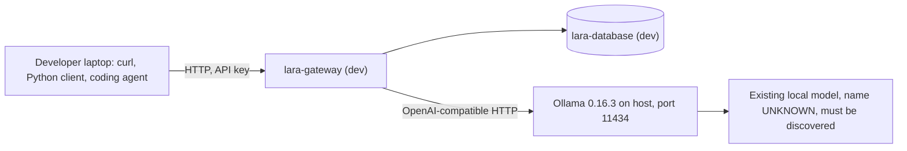

Purpose: unblock all application-layer work (auth, keys, database, queue, scheduler, priorities, modes, telemetry, admin API, tunnel) without occupying or depending on the production GPU.

### 2.6 Diagram 9: production inference architecture (final)

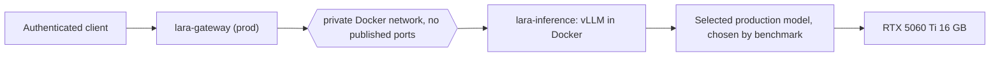

**PRD REQUIREMENT.** Ollama is a development accelerator only. It is never a production dependency, Ollama Cloud is never used, and vLLM is never removed from the production architecture.

### 2.7 Environment table

| Property | `dev-laptop` | `prod-workstation` |
| --- | --- | --- |
| Purpose | Application-layer development and testing | Production service, GPU truth |
| Inference backend | Ollama 0.16.3 on host | Dockerized vLLM |
| Backend base URL | `http://host.docker.internal:11434` (verify from WSL2/Docker context) | `http://lara-inference:8000` |
| GPU required | No | Yes |
| Database | PostgreSQL container, ephemeral volume acceptable | PostgreSQL container, persistent named volume |
| Transport | Localhost only | Cloudflare Tunnel (Session 6) |
| Valid for testing | API, auth, keys, queue, scheduler, priority, modes, telemetry, admin, database, streaming behaviour, tunnel | Everything, plus all performance claims |
| Never valid for | Any performance, VRAM, throughput, thermal, or concurrency claim | n/a |
| Env selector | `LARA_ENV=dev` | `LARA_ENV=prod` |

**PRD-aligned rule** (PRD 15.1, master task section 39): the Ollama machine never validates production GPU performance. Two separate test suites exist for this reason. See section 24.

---

## 3. Services, Networks, Ports, and Repository

### 3.1 Service table

| Service | Image basis | Session introduced | Purpose | Restart policy |
| --- | --- | --- | --- | --- |
| `lara-gateway` | Python 3.x slim + FastAPI (built) | 3 | The entire application layer: auth, keys, validation, queue, scheduler, modes, routing, telemetry API, admin API | `unless-stopped` |
| `lara-inference` | Official vLLM image, tag pinned | 2 (prod), optional in dev | OpenAI-compatible model serving on the GPU | `unless-stopped` |
| `lara-database` | Official PostgreSQL image, tag pinned | 3 | Users, keys, models, jobs, telemetry, audit | `unless-stopped` |
| `lara-telemetry` | Python slim (built) | 7 (usable earlier) | Periodic GPU and system sampling into PostgreSQL | `unless-stopped` |
| `lara-cloudflared` | Official cloudflared image, tag pinned | 6 | Outbound tunnel to the Cloudflare edge | `unless-stopped` |

**ENGINEERING RECOMMENDATION.** The PRD names a `monitoring` container. This blueprint implements it as `lara-telemetry`: a small sampler that writes to PostgreSQL, with the gateway exposing the read APIs and a minimal dashboard. A Prometheus and Grafana stack is free and self-hostable, and remains a legitimate later option, but it adds two services and a second data store for a single-node deployment with roughly twelve concurrent users. Add it only if the simple sampler proves insufficient (PRD 1.3 principle 13).

### 3.2 Network table

| Docker network | Members | Externally reachable | Purpose |
| --- | --- | --- | --- |
| `lara_edge` | `lara-cloudflared`, `lara-gateway` | No inbound. Cloudflared makes outbound connections only. | Carries public traffic to the gateway and nothing else. |
| `lara_core` | `lara-gateway`, `lara-inference`, `lara-database`, `lara-telemetry` | No | Internal service plane. `internal: true` so containers on it have no route off the host. |

`lara-inference`, `lara-database`, and `lara-telemetry` attach only to `lara_core`. `lara-gateway` is the only service on both networks. This is the enforcement point for PRD 5.5 and 16.3.

### 3.3 Port table

| Service | Container port | Host binding | Reachable from LAN | Reachable from Internet |
| --- | --- | --- | --- | --- |
| `lara-gateway` | 8080 | `127.0.0.1:8080` (loopback only) | No, except deliberately during Session 2 to 5 local testing | Only via the tunnel, from Session 6 |
| `lara-inference` | 8000 | **none** | No | **Never** |
| `lara-database` | 5432 | **none** in prod. `127.0.0.1:55432` permitted in `dev` only. | No | **Never** |
| `lara-telemetry` | no listener | none | No | Never |
| `lara-cloudflared` | no listener | none | No | Outbound 443 only |

**PRD REQUIREMENT** (PRD 5.5, 16.3). Any `ports:` entry on `lara-inference` or a non-loopback binding on `lara-database` is a security defect, not a convenience. Session 6 includes an explicit port audit that fails the gate if either appears.

### 3.4 Compose skeleton

**ENGINEERING RECOMMENDATION.** Illustrative shape only, not final. Real values live in `.env`.

```yaml
name: lara

services:
  lara-gateway:
    build: ./gateway
    env_file: .env
    depends_on:
      lara-database:
        condition: service_healthy
    networks: [lara_core, lara_edge]
    ports:
      - "127.0.0.1:8080:8080"
    restart: unless-stopped
    healthcheck:
      test: ["CMD", "curl", "-fsS", "http://localhost:8080/health"]
    logging:
      driver: json-file
      options: { max-size: "100m", max-file: "5" }

  lara-inference:
    image: <pinned-vllm-image>          # UNKNOWN - MUST BE VERIFIED
    profiles: ["prod"]                   # not started in dev
    command: [ ... ]                     # built from model config, see section 22
    volumes:
      - ${LARA_MODEL_DIR}:/models:ro
    networks: [lara_core]                # no ports:
    restart: unless-stopped
    deploy:
      resources:
        reservations:
          devices: [{ driver: nvidia, count: 1, capabilities: ["gpu"] }]

  lara-database:
    image: postgres:<pinned>
    environment: [ ... ]
    volumes: [lara_pgdata:/var/lib/postgresql/data]
    networks: [lara_core]
    restart: unless-stopped
    healthcheck:
      test: ["CMD-SHELL", "pg_isready -U $${POSTGRES_USER}"]

  lara-telemetry:
    build: ./monitoring
    profiles: ["prod"]
    networks: [lara_core]
    restart: unless-stopped

  lara-cloudflared:
    image: cloudflare/cloudflared:<pinned>
    profiles: ["tunnel"]
    command: tunnel --no-autoupdate run
    environment:
      - TUNNEL_TOKEN=${CLOUDFLARE_TUNNEL_TOKEN}
    networks: [lara_edge]
    restart: unless-stopped

networks:
  lara_core:
    internal: true
  lara_edge: {}

volumes:
  lara_pgdata: {}
```

Notes:

1. Docker Compose profiles keep the dev environment from trying to start a GPU container.
2. The GPU reservation syntax that actually works with the installed Docker and NVIDIA Container Toolkit versions is **UNKNOWN — MUST BE VERIFIED** in Session 1. Both the `deploy.resources.reservations.devices` form and the `gpus: all` form exist in the wild; pick the one that works on this host and use it consistently.
3. Per-container `json-file` log caps are the first line of defence for the 20 GB budget (PRD 12.1). See section 23.

### 3.5 Repository layout

```text
lara/
├── README.md
├── LICENSE
├── .gitignore                     # must exclude .env, *.pt, *.safetensors, *.gguf, models/
├── .env.example
├── compose.yaml
│
├── gateway/
│   ├── Dockerfile
│   ├── requirements.txt
│   └── app/
│       ├── main.py
│       ├── config.py
│       ├── auth/                  # API keys, password hashing, dependencies
│       ├── api/                   # v1 (public), lara (extensions), admin
│       ├── scheduler/             # queue, slots, priority, job lifecycle
│       ├── models/                # registry, backend adapters, alias resolution
│       ├── users/                 # user and role management
│       ├── analytics/             # rollups, leaderboard
│       └── monitoring/            # health, status, metrics read APIs
│
├── inference/
│   ├── configs/                   # model configuration files (source of truth for vLLM args)
│   └── scripts/                   # model preflight, VRAM probe, smoke test
│
├── database/
│   ├── migrations/                # Alembic
│   └── seed/                      # roles, owner account, initial model rows
│
├── monitoring/
│   ├── Dockerfile
│   └── collector/                 # NVML sampler
│
├── scripts/
│   ├── start.sh  stop.sh  health.sh
│   ├── mode.sh                    # wraps the admin mode API
│   ├── model.sh                   # wraps the model switch runbook
│   └── audit-ports.sh             # Session 6 exposure audit
│
├── docs/
│   ├── architecture/
│   ├── operations/                # runbooks: model switch, recovery, provisioning
│   ├── clients/                   # per-agent setup guides
│   ├── security/
│   └── benchmarks/                # measured results, dated, with hardware context
│
└── tests/
    ├── unit/
    ├── integration/               # runs against the dev backend
    ├── load/                      # concurrency and queue behaviour
    └── production/                # GPU-only suite, see section 24
```

**PRD REQUIREMENT** (PRD 14.4, Appendix D rule 3). No `inference/Dockerfile` appears above. The production inference service uses a pinned upstream vLLM image with mounted model weights. A custom Dockerfile is added only if a real need appears, and it never bakes model weights into the image.

`docs/benchmarks/` is created empty in Session 1 and is the only place measured numbers are allowed to live. Nothing in this blueprint may be updated with a performance figure that does not have a dated file there.
---

## 4. The Seven Sessions

### 4.1 Session map

| Session | Focus | End state | Scope |
| --- | --- | --- | --- |
| **1** | Host infrastructure and GPU foundation | RTX 5060 Ti reliably available to Docker, surviving reboot | V1 |
| **2** | Inference engine | Local OpenAI-compatible model serving works, on vLLM in production and on Ollama for development | V1 |
| **3** | Gateway and authentication | Authenticated service boundary in front of the inference runtime | V1 |
| **4** | Queue and scheduler | 3 active jobs, queue, priorities, cancellation, job telemetry | V1 |
| **5** | Modes and model management | Serving / Personal / Game Dev policies plus configuration-driven model registry and switching | V1 |
| **6** | Global access and security hardening | Secure HTTPS access from anywhere with no inbound port | V2 |
| **7** | Observability, testing, V1 freeze | Measured, tested, reproducible release | V1 freeze + V2 analytics |

### 4.2 Diagram 2: session dependency graph

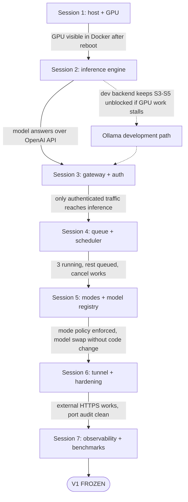

### 4.3 Gating rules

**ENGINEERING RECOMMENDATION**, and the reason the roadmap is ordered this way:

1. Sessions are gates, not sprints. Do not begin a session until the previous Exit Gate is signed off in `docs/operations/exit-gates.md` with the date and the evidence.
2. Do not write application logic while the GPU runtime is still questionable. Session 1 produces no FastAPI code.
3. Do not attempt the tunnel until Sessions 1 to 5 work locally. Debugging five systems at once is how a project becomes archaeology.
4. One documented bypass exists: if Session 2's production vLLM path is blocked by a runtime or driver unknown (section 2.2), Sessions 3 to 5 may proceed against the Ollama development backend. The Session 2 production exit gate still has to be closed before Session 7, and no performance claim may be made until it is.

### 4.4 Session deliverables table

| Session | Primary deliverables | Artifacts committed |
| --- | --- | --- |
| 1 | Verified Windows to GPU chain, resource baseline, repository skeleton | `compose.yaml` stub, `.env.example`, `docs/operations/host-setup.md`, `docs/benchmarks/baseline-idle.md` |
| 2 | vLLM container running a benchmarked candidate model, Ollama dev backend documented, streaming verified | `inference/configs/*.yaml`, `inference/scripts/*`, `docs/benchmarks/model-candidates.md`, `docs/clients/` |
| 3 | FastAPI gateway, PostgreSQL schema, users, roles, API keys, streaming proxy, health | `gateway/`, `database/migrations/`, `docs/security/auth.md` |
| 4 | Scheduler with 3-slot ceiling, queue, priority, cancellation, job records | `gateway/app/scheduler/`, `tests/load/`, `docs/architecture/scheduler.md` |
| 5 | Mode engine, GPU pressure policy, model registry, alias resolution, switch runbook | `gateway/app/models/`, `scripts/mode.sh`, `scripts/model.sh`, `docs/operations/model-switch.md` |
| 6 | Cloudflare Tunnel, external access, abuse controls, port audit | `scripts/audit-ports.sh`, `docs/security/exposure.md`, `docs/operations/tunnel.md` |
| 7 | Telemetry, analytics, leaderboard, full test matrix, production benchmarks, V1 freeze | `monitoring/`, `tests/production/`, `docs/benchmarks/v1-*.md`, `docs/operations/recovery.md` |

---

## 5. Core Operational Semantics

These semantics are cross-cutting. They are specified once here and implemented across Sessions 3 to 5.

### 5.1 Diagram 3: request lifecycle

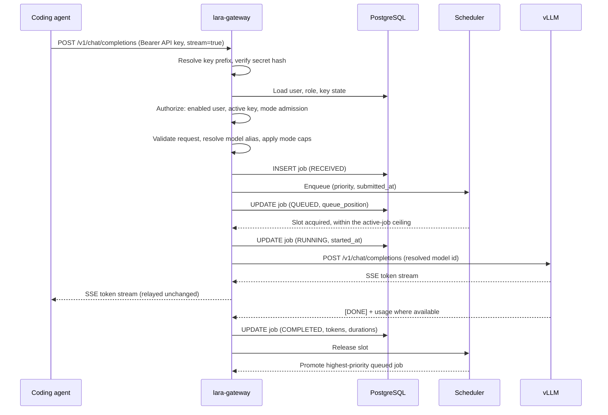

Rules that fall out of this sequence:

1. **The slot is held for the whole upstream call**, from request dispatch to final chunk. It is released in a `finally` path so that failures and disconnects cannot leak slots.
2. **Queue wait happens before any upstream call.** Nothing touches the GPU while queued.
3. **The gateway never rewrites token content.** It relays the upstream stream. It may append LARA metadata headers and it may emit SSE comment lines while queued (section 5.2.3), but it does not edit model output.
4. **Prompts are not persisted** (PRD 12.4). The job row stores counts and timings, not content.

### 5.2 Job state machine

#### 5.2.1 Diagram 4: states

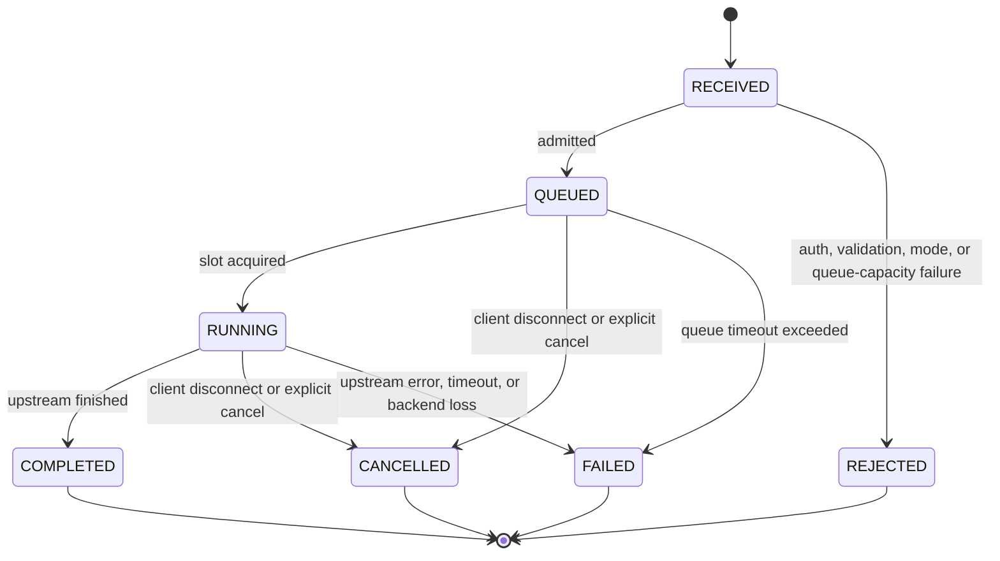

**ENGINEERING RECOMMENDATION.** `REJECTED` is added to the PRD's set so that refused requests are countable and distinguishable from failures. It is a terminal state recorded without a queue entry.

#### 5.2.2 Terminal-state behaviour matrix

| Event | Job state transition | Slot | Client sees | Recorded |
| --- | --- | --- | --- | --- |
| Client disconnects while `QUEUED` | `CANCELLED` | never held | connection closed | `error_class=client_disconnect` |
| Client disconnects while `RUNNING` | `CANCELLED` | released immediately, upstream request aborted | connection closed | partial output tokens if known |
| Explicit cancel of own queued job | `CANCELLED` | n/a | `200` on the cancel call | `error_class=user_cancel` |
| Explicit cancel of own running job | `CANCELLED` | released | stream terminates | `error_class=user_cancel` |
| Upstream returns 4xx (bad request, unknown model) | `FAILED` | released | upstream error passed through with LARA request id | `error_class=upstream_4xx` |
| Upstream returns 5xx or connection drops | `FAILED` | released | `502` with LARA request id | `error_class=upstream_5xx` |
| No first token within `LARA_TTFT_TIMEOUT_S` | `FAILED` | released, upstream aborted | `504` | `error_class=ttft_timeout` |
| Total generation exceeds `LARA_REQUEST_TIMEOUT_S` | `FAILED` | released, upstream aborted | stream terminated with error event | `error_class=generation_timeout` |
| Queue wait exceeds `LARA_QUEUE_TIMEOUT_S` | `FAILED` | never held | `503` with retry guidance | `error_class=queue_timeout` |
| Queue depth at `LARA_QUEUE_MAX_DEPTH` on arrival | `REJECTED` | n/a | `429` | `error_class=queue_full` |
| Gateway restarts | see 5.2.4 | reset | connection dropped | reconciled on boot |
| vLLM restarts (model switch, crash) | `RUNNING` jobs to `FAILED`, `QUEUED` jobs held | released | error or held | `error_class=backend_restart` |

#### 5.2.3 Streaming and queue visibility

**Engineering Note / Potential Revision.** OpenAI-compatible clients expect one HTTP response, so a queued request has to hold the connection open. Two consequences:

1. For `stream=true`, the gateway may flush response headers immediately and emit SSE comment lines (lines beginning with `:`) as keepalives while queued, for example `: lara queued position=4`. SSE comments are ignored by conforming clients. Whether each target agent tolerates this **UNKNOWN — MUST BE VERIFIED** per client in Session 2 and again in Session 4.
2. For `stream=false`, nothing can be sent until the job completes. Long queue waits look like a slow request. `LARA_QUEUE_TIMEOUT_S` exists to bound this, and the queue state is separately observable at `GET /lara/queue`.

Queue state is also exposed in response headers where the client permits: `X-LARA-Request-Id`, `X-LARA-Queue-Wait-Ms`, `X-LARA-Mode`, `X-LARA-Model`.

#### 5.2.4 Restart reconciliation

**ENGINEERING RECOMMENDATION.** The scheduler is in-process; the job table is durable. On gateway boot, any job still marked `QUEUED` or `RUNNING` from a previous process is closed as `FAILED` with `error_class=gateway_restart`. Do not attempt to resume: the client's HTTP connection is already gone. Reconciliation must run before the gateway accepts traffic, so that queue depth and active-job counts start from truth.

### 5.3 Operating modes and GPU pressure

#### 5.3.1 Diagram 5: modes

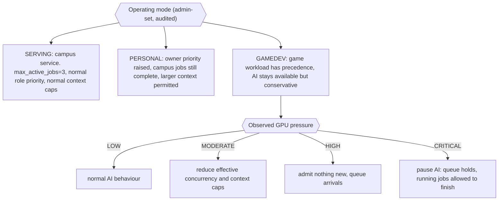

#### 5.3.2 Mode policy fields

Every mode is a row of configuration, not a branch in code (**PRD REQUIREMENT** 8.4, master task 27).

| Policy field | SERVING (default) | PERSONAL (default) | GAMEDEV (default) |
| --- | --- | --- | --- |
| `max_active_jobs` | 3 | 3 | 3, reduced by pressure |
| `per_user_max_active` | 1 | owner unlimited up to ceiling, others 1 | 1 |
| `max_context_tokens` | NOT YET MEASURED | NOT YET MEASURED, may be larger | NOT YET MEASURED, may be smaller |
| `max_output_tokens` | NOT YET MEASURED | NOT YET MEASURED | NOT YET MEASURED |
| `owner_priority_bonus` | 0 | large positive | 0 |
| `pressure_policy_enabled` | false | false | true |
| `queue_max_depth` | configurable | configurable | configurable |
| `preemption` | none | none | none |

**PRD REQUIREMENT** (PRD 8.2, master task 27): running campus jobs are allowed to finish. Preemption is not implemented in V1. If a future measurement shows the owner is unacceptably blocked, that is a PRD amendment, not an implementation decision.

All defaults above are seeds. Real values are set after Session 7 benchmarking.

#### 5.3.3 GPU pressure model

**ENGINEERING RECOMMENDATION.** Pressure is derived from a rolling window of telemetry samples, not from a single reading, so that a one-frame spike does not pause the service.

| Input | Source | Why it matters |
| --- | --- | --- |
| GPU utilization percent | NVML sample, rolling median over window | Sustained saturation means the game workload is being starved. |
| VRAM used vs total | NVML sample | The dominant constraint (PRD 3.3). |
| VRAM used outside the vLLM reservation | total used minus known inference allocation | The best available proxy for what the game engine is consuming. |
| GPU temperature | NVML sample | Thermal protection and throttling detection. |
| Active LARA jobs | scheduler | Distinguishes LARA-caused pressure from external pressure. |

Thresholds for `LOW`, `MODERATE`, `HIGH`, `CRITICAL` are configuration and are **NOT YET MEASURED**. They are set in Session 7 against a real Unity or Unreal workload, not guessed in Session 5. The seed configuration ships with the policy engine enabled and thresholds set to values that are explicitly marked provisional in `.env.example`.

**Engineering Note / Potential Revision, and this one matters.** vLLM reserves its share of VRAM when the container starts. LARA therefore cannot hand VRAM back to a game engine at runtime by throttling requests. Under pressure, the levers that actually exist in V1 are:

1. admission control: fewer concurrent jobs, smaller context and output caps, queue or pause new work;
2. an explicit operational action: restart `lara-inference` with a smaller memory fraction using a dedicated `gamedev` model profile, accepting a service interruption of the model-load duration.

Anything that claims to continuously rebalance VRAM between a game engine and a running vLLM instance would be fiction. The PRD's rejection of "AI gets exactly 30% GPU" (PRD 10.3) is correct, and this is the concrete reason why.

### 5.4 Priority and fairness

**PRD REQUIREMENT** (PRD 9.4, 9.5). Priority is configurable. Priority must not become starvation.

| Element | V1 behaviour |
| --- | --- |
| Priority source | `roles.priority` integer, configurable, plus the active mode's `owner_priority_bonus` |
| Seed roles | `owner`, `admin`, `developer`, `researcher`, `member` with descending default weights. Names and weights are seed data in `database/seed/`, not constants in code. |
| Selection rule | Highest effective priority first; FIFO by `submitted_at` within equal priority |
| Anti-starvation | `per_user_max_active` prevents one user from holding all slots. Aging, weighted fair queueing, and maximum consecutive jobs are **deferred** until telemetry demonstrates starvation (PRD 9.5). |
| Starvation detection | Session 7 analytics report: p95 queue wait by role. If low-priority p95 grows without bound, implement aging. |

**ENGINEERING RECOMMENDATION.** Store the effective priority on the job row at enqueue time. Recomputing priority mid-queue makes behaviour hard to reason about and hard to test.

---

## 6. V1 and V2 Scope

**PRD REQUIREMENT** (PRD 18.10, 18.11, master task 37). Keep these strictly separated. V2 features must never block local V1 development.

| Capability | V1 | V2 | Notes |
| --- | --- | --- | --- |
| Local GPU inference through vLLM in Docker | Yes | inherited | Sessions 1, 2 |
| OpenAI-compatible API surface | Yes | inherited | Session 2, 3 |
| Gateway authentication and API keys | Yes | inherited | Session 3 |
| PostgreSQL, local only | Yes | inherited | Session 3 |
| Three active jobs, queue, priorities, cancellation | Yes | inherited | Session 4 |
| Operating modes and GPU pressure policy | Yes | inherited | Session 5 |
| Configuration-driven model registry and switching | Yes | inherited | Session 5 |
| Job and GPU telemetry | Yes | inherited | Sessions 4, 7 |
| Reproducible Compose deployment and recovery | Yes | inherited | Sessions 1, 7 |
| Global HTTPS through Cloudflare Tunnel | No | Yes | Session 6 |
| Up to 50 provisioned accounts in real external operation | No | Yes | Session 6 |
| Usage analytics and leaderboard | No | Yes | Session 7 |
| Hardened external abuse controls | No | Yes | Session 6 |
| Broader operational tooling and dashboards | No | Yes | Session 7 |

### 6.1 Excluded from V1 entirely

**PRD REQUIREMENT** (PRD 2.3, 14.2, Appendix D, master task 38). None of the following enters V1 without a PRD amendment: Kubernetes, Kafka, Redis (without a measured need), Qdrant, Neo4j, RAG infrastructure, distributed inference, multiple GPUs, cloud GPUs, hosted databases, hosted authentication, student repository hosting, remote code execution, autonomous server-side coding agents, billing or subscriptions, token quotas, university-wide SSO, and commercial AI APIs.

**ENGINEERING RECOMMENDATION on Redis specifically.** The only design that would require it is a multi-process or multi-host gateway, because the slot semaphore would then need shared state. LARA runs one gateway process for roughly twelve concurrent users and a 3-job ceiling. If horizontal gateway scaling is ever genuinely required, the cheapest correct answer is PostgreSQL advisory locks, which introduces no new service. Redis remains unnecessary.
---

# PART II — THE SEVEN SESSIONS

---

# Session 1 — Host Infrastructure and GPU Foundation

## Objective

Turn the Windows 11 workstation into a reliable GPU-enabled Docker host, and prove it survives a reboot.

## Why This Session Exists

Every later session assumes a working chain from Windows through WSL2 through Docker to CUDA to the RTX 5060 Ti. If that chain is intermittent, every later failure becomes ambiguous: a hung request could be a scheduler bug, a vLLM bug, or a GPU that silently vanished from the container after a Windows update. Isolating the platform layer into its own gated session means later debugging starts from a known-good foundation.

No application logic is written in this session. Writing FastAPI code while the GPU runtime is still questionable is the classic way to spend a week debugging the wrong layer.

## Prerequisites

| Prerequisite | Verification |
| --- | --- |
| Physical access to the production workstation | n/a |
| Administrator rights on Windows 11 | n/a |
| Working outbound Internet from the workstation | `curl` to a package registry succeeds |
| Git installed and a remote repository available | `git --version`, remote push works |
| Free disk space for images and model cache | Record actual free space; model cache sizing is **UNKNOWN — MUST BE VERIFIED** until a candidate model is chosen |

## Deliverables

1. Verified and recorded Windows to GPU chain.
2. Recorded idle resource baseline in `docs/benchmarks/baseline-idle.md`.
3. Documented host setup procedure in `docs/operations/host-setup.md`, sufficient to rebuild the host from scratch.
4. Repository skeleton, `.gitignore`, `.env.example`, `compose.yaml` stub committed.
5. Reboot-survival evidence.

## Architecture

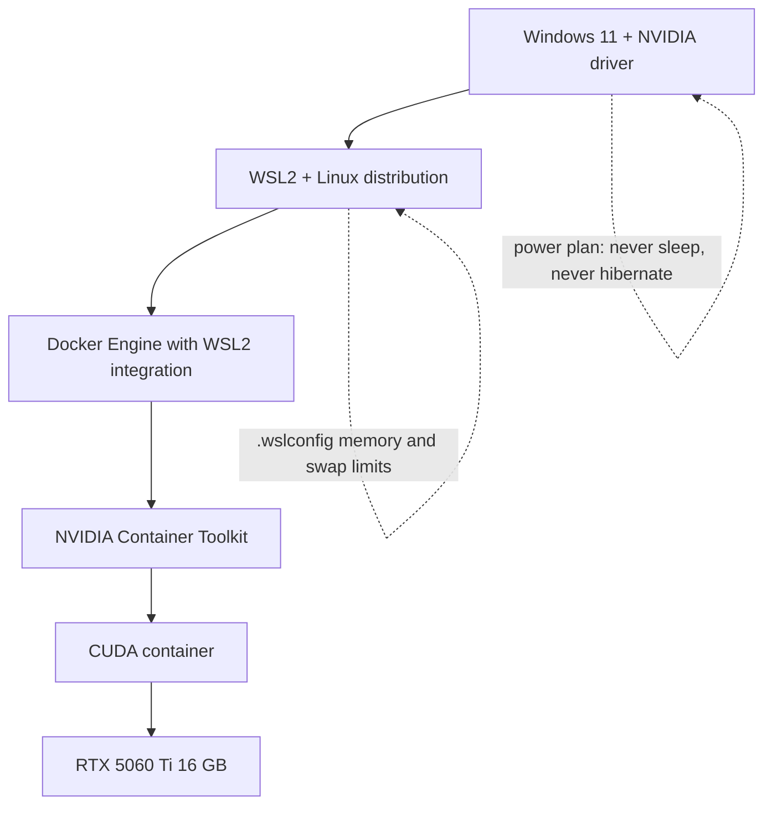

Each arrow is verified independently. A failure at any layer is diagnosed at that layer, not at the top.

## Implementation Tasks

### 1. Windows layer

1. Verify the NVIDIA driver is installed and current enough for CUDA under WSL2. The minimum version for this GPU generation is **UNKNOWN — MUST BE VERIFIED** against current NVIDIA documentation.
2. Run `nvidia-smi` on Windows. Record verbatim: driver version, CUDA version reported, GPU name, total memory in MiB. Confirm the reported name and memory match the PRD hardware table (approximately 16,311 MiB).
3. Configure power: never sleep, never hibernate, disk never powers down, USB selective suspend off if it affects the network adapter. A 24/7 service that sleeps is not a service.
4. Confirm Wi-Fi does not power down to save energy, and record whether the adapter reconnects automatically after an outage.
5. Record the Windows update policy chosen. **Engineering Note:** an unattended driver update or forced restart will take the service down and can change GPU behaviour. Decide deliberately and write the decision down.

### 2. WSL2 layer

1. Install or verify WSL2 and a Linux distribution. Record distribution and kernel version.
2. Verify GPU passthrough from inside WSL2: `nvidia-smi` inside the distribution should report the same GPU.
3. Verify the CUDA runtime is visible from inside WSL2.
4. Configure `.wslconfig` with explicit memory and swap limits. **ENGINEERING RECOMMENDATION:** leave clear headroom for Windows and any game engine on a 64 GB host rather than letting WSL2 claim a large default share. Record the values chosen and why.
5. Confirm the WSL2 instance restarts cleanly and that GPU visibility returns without manual intervention.

### 3. Docker layer

1. Install Docker with WSL2 integration enabled. Record the Docker version and how it was installed.
2. Install and configure the NVIDIA Container Toolkit.
3. Verify a GPU container can see the card:

```bash
docker run --rm --gpus all <cuda-base-image>:<pinned-tag> nvidia-smi
```

The exact image and tag are **UNKNOWN — MUST BE VERIFIED**; use a CUDA base image whose version matches what the driver reports.

4. Determine which GPU-request syntax works on this host (`--gpus all` on the CLI, and either `deploy.resources.reservations.devices` or `gpus:` in Compose). Record the working form and use only that form thereafter.
5. Verify a GPU container also works through Docker Compose, not only through `docker run`. These fail differently.

### 4. Resource baseline

Record at idle, with nothing else running, and again with the desktop in normal use:

| Metric | Source | Recorded value |
| --- | --- | --- |
| VRAM used at idle | `nvidia-smi` | NOT YET MEASURED |
| VRAM used with browser and desktop in normal use | `nvidia-smi` | NOT YET MEASURED |
| GPU utilization at idle | `nvidia-smi` | NOT YET MEASURED |
| GPU temperature at idle | `nvidia-smi` | NOT YET MEASURED |
| GPU power draw at idle | `nvidia-smi` | NOT YET MEASURED |
| Host RAM used at idle | Task Manager and `free -h` in WSL2 | NOT YET MEASURED |
| CPU utilization at idle | Task Manager | NOT YET MEASURED |
| Free disk on the model-storage volume | `df -h` | NOT YET MEASURED |

This baseline is what makes later VRAM statements meaningful. Without it, "the model uses X GB" is not a measurement.

### 5. Model storage location

1. Choose a host directory for model weights, outside the repository, on a volume with room to grow. The PRD's illustrative path is a Windows path; the actual path is deployment configuration.
2. Record whether weights live on a Windows volume accessed through the WSL2 mount layer or inside the WSL2 filesystem. **Engineering Note / Potential Revision:** cross-filesystem access through the Windows mount layer can be materially slower than the native Linux filesystem, which affects model load time and therefore model-switch downtime. Measure both if convenient; record the choice either way.
3. Set `LARA_MODEL_DIR` in `.env.example` and document the mount into the container as read-only at `/models`.

### 6. Repository initialization

1. Create the repository named `lara` with the structure in section 3.5.
2. Commit `.gitignore` first, covering `.env`, `*.safetensors`, `*.gguf`, `*.bin`, `*.pt`, `models/`, and any local cache directory. **PRD REQUIREMENT** (Appendix D rule 3): model weights never enter Git.
3. Commit `.env.example` with every key documented and no real secret values.
4. Commit a `compose.yaml` stub containing only what Session 1 can prove works: a GPU smoke-test service. Services are added in the sessions that introduce them.
5. Commit `README.md` describing what LARA is, using the definition in section 27.

## Repository Changes

```text
lara/
├── README.md                 (new)
├── LICENSE                   (new)
├── .gitignore                (new)
├── .env.example              (new)
├── compose.yaml              (new, stub)
├── scripts/health.sh         (new, host-level checks only)
├── docs/operations/host-setup.md    (new)
├── docs/benchmarks/baseline-idle.md (new)
└── (empty directories per section 3.5, each with .gitkeep)
```

## Interfaces

No HTTP interfaces exist yet. The interfaces of this session are host-level commands:

| Interface | Purpose |
| --- | --- |
| `nvidia-smi` (Windows) | Driver, GPU identity, memory truth |
| `nvidia-smi` (inside WSL2) | Passthrough verification |
| `docker run --gpus all ... nvidia-smi` | Container GPU verification |
| `docker compose up` on the smoke-test service | Compose-level GPU verification |
| `scripts/health.sh` | One command that runs all of the above and prints pass or fail per layer |

## Data Flow

```text
nvidia-smi (Windows)      -> recorded in docs/operations/host-setup.md
nvidia-smi (WSL2)         -> recorded in docs/operations/host-setup.md
container nvidia-smi      -> recorded in docs/operations/host-setup.md
idle sampling             -> recorded in docs/benchmarks/baseline-idle.md
```

No application data flows in this session. Nothing is written to a database because no database exists yet.

## Configuration

| Key | Introduced here | Purpose |
| --- | --- | --- |
| `LARA_ENV` | Yes | `dev` or `prod` |
| `LARA_MODEL_DIR` | Yes | Host path for model weights, mounted read-only at `/models` |
| `LARA_LOG_LEVEL` | Yes | Gateway log level, consumed from Session 3 |
| `COMPOSE_PROFILES` | Yes | Controls which services start per environment |

Windows power settings, `.wslconfig`, and driver versions are host configuration, not repository configuration. They are documented in `docs/operations/host-setup.md` so the host can be rebuilt.

## Security Considerations

1. Nothing is published to the network in this session. The smoke-test service exposes no ports.
2. `.gitignore` is committed before anything else, so a secret or a weight file cannot be committed by accident.
3. If Docker Desktop or the WSL2 integration exposes a daemon socket over TCP, disable it. **PRD REQUIREMENT** (PRD 16.3): the Docker daemon is never exposed.
4. Confirm no Windows firewall rule was created that opens a LAN port for Docker or WSL2 services. Record the state of the firewall before and after installation.

## Failure Modes

| Failure | Likely cause | Response |
| --- | --- | --- |
| `nvidia-smi` works on Windows but not inside WSL2 | Driver too old, WSL kernel too old, or WSL not updated | Update WSL kernel and driver; re-verify both layers separately |
| GPU visible in WSL2 but not in the container | NVIDIA Container Toolkit missing or misconfigured, Docker not restarted | Reinstall toolkit, restart Docker, retest with `docker run` before Compose |
| GPU works with `docker run` but not through Compose | Wrong GPU-request syntax for this Compose version | Test both syntaxes, record the working one, standardize on it |
| GPU disappears after reboot | WSL2 or Docker not starting automatically, or driver reset | Fix autostart; this is a hard blocker for the exit gate |
| GPU disappears after Windows update | Driver replaced | Document the update policy and the recovery procedure |
| Workstation sleeps overnight | Power plan not applied to the active profile | Re-apply and re-verify after reboot |
| Docker consumes excessive host RAM | `.wslconfig` limits absent | Set explicit limits, retest |

## Testing

| ID | Test | Method | Pass criterion |
| --- | --- | --- | --- |
| T-S1-01 | Windows GPU identity | `nvidia-smi` | Reports RTX 5060 Ti and approximately 16,311 MiB |
| T-S1-02 | WSL2 GPU passthrough | `nvidia-smi` inside WSL2 | Same GPU reported |
| T-S1-03 | Container GPU access | `docker run --rm --gpus all <cuda-image> nvidia-smi` | Same GPU reported inside the container |
| T-S1-04 | CUDA workload executes | Run a trivial CUDA sample or a device-query workload in a container | Completes successfully, non-zero GPU activity observed |
| T-S1-05 | Compose GPU access | `docker compose up` on the smoke-test service | Same result as T-S1-03 |
| T-S1-06 | Reboot survival | Full Windows restart, then rerun T-S1-01 to T-S1-05 with no manual intervention beyond starting Docker if that is the documented procedure | All pass |
| T-S1-07 | Sleep resistance | Leave the machine idle for a documented interval | Machine still reachable and GPU still available |
| T-S1-08 | Baseline recorded | Inspect `docs/benchmarks/baseline-idle.md` | All rows populated with real values and a date |
| T-S1-09 | Repository hygiene | `git status` after creating a dummy weight file in `LARA_MODEL_DIR` and a local `.env` | Neither appears as untracked-and-committable |

## Acceptance Criteria

- [ ] `nvidia-smi` reports the RTX 5060 Ti on Windows, inside WSL2, and inside a Docker container.
- [ ] A CUDA workload runs to completion inside a container.
- [ ] Compose can start a GPU container using the recorded syntax.
- [ ] The full chain works after a cold reboot without ad-hoc fixes.
- [ ] The idle resource baseline is recorded with real numbers and a date.
- [ ] The repository skeleton, `.gitignore`, `.env.example`, and `compose.yaml` stub are committed.
- [ ] `docs/operations/host-setup.md` is complete enough to rebuild this host.
- [ ] No application logic was written.

## Exit Gate

**Session 2 may not begin until all of the following are true:**

1. This chain works reliably and reproducibly after reboot:

```text
Windows 11 -> WSL2 -> Docker -> CUDA container -> RTX 5060 Ti
```

2. The exact driver, CUDA, WSL2, Docker, and NVIDIA Container Toolkit versions are recorded in `docs/operations/host-setup.md`.
3. The idle baseline exists in `docs/benchmarks/baseline-idle.md`.
4. The GPU-request syntax that works with this Docker and Compose version is recorded and standardized.
5. The exit gate is signed and dated in `docs/operations/exit-gates.md`.

If the GPU chain is intermittent, the correct action is to stop and fix it. Proceeding to Session 2 with an unreliable foundation makes every subsequent failure ambiguous.
---

# Session 2 — Inference Engine

## Objective

Get real inference working through an OpenAI-compatible HTTP API: Dockerized vLLM on the production workstation, and the existing Ollama installation as a temporary development backend.

## Why This Session Exists

The inference runtime is the component with the most unknowns and the least tolerance for guesswork. Model compatibility, quantization support, VRAM behaviour, context limits, and streaming semantics all resolve here. Doing this before the gateway exists means the gateway is written against a backend whose behaviour is known, rather than against an assumption.

This session also establishes the development path that keeps Sessions 3 to 5 unblocked if the production runtime hits the GPU-generation risk described in section 2.2.

## Prerequisites

1. Session 1 exit gate closed.
2. GPU chain verified after reboot.
3. `LARA_MODEL_DIR` chosen, with recorded free space.
4. Outbound access to a model repository and a container registry.
5. On the development machine: Ollama 0.16.3 running, with its installed model discovered (never assumed).

## Deliverables

1. `lara-inference` running vLLM in Docker on the production workstation, serving a candidate model.
2. Model configuration files under `inference/configs/`, one per candidate, as the single source of truth for runtime arguments.
3. Preflight and smoke-test scripts under `inference/scripts/`.
4. Discovered Ollama development backend documented, including whether it supports each required endpoint.
5. `docs/benchmarks/model-candidates.md` with measured results per candidate.
6. `docs/clients/` with a verified setup guide for at least one coding agent.

## Architecture

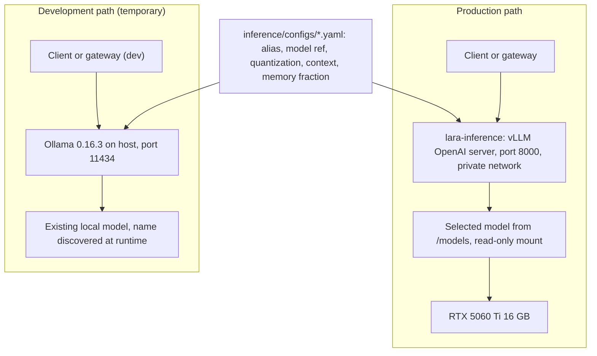

Both backends speak an OpenAI-compatible dialect. The gateway written in Session 3 targets that dialect, not a specific runtime, which is what makes the development path disposable.

## Implementation Tasks

### 1. Pin the vLLM image

1. Choose a published vLLM image tag. Which tag contains kernels for this GPU generation is **UNKNOWN — MUST BE VERIFIED** (section 2.2).
2. Pin the exact tag in `compose.yaml`. Never use a floating tag for the inference runtime: a silent upgrade can change memory behaviour, supported quantizations, and API surface.
3. Record the tag, the CUDA version it ships, and the date verified in `docs/operations/inference-runtime.md`.

### 2. Model candidate selection

**PRD REQUIREMENT** (PRD 7.5, Appendix D rule 12). The production model is chosen by benchmark, not by reputation. This document names no model.

1. Select candidates in the class the PRD specifies: strong 7 to 8 billion parameter coding and reasoning models in an appropriate quantized format for a 16 GB GPU.
2. For each candidate, before downloading, record: architecture family, format, quantization, license, published context length, and whether the tokenizer ships a chat template that supports tool calling.
3. Run the compatibility preflight in section 22.2. Reject candidates on paper before spending bandwidth.
4. Download to `LARA_MODEL_DIR`. Never into the repository.

### 3. Configure and start vLLM

1. Write one config file per candidate under `inference/configs/`, containing only arguments that the pinned vLLM version actually accepts (section 22.3).
2. Start `lara-inference` with the mounted model directory read-only and no published ports.
3. Confirm startup logs report the model loaded, the KV cache size allocated, and the maximum sequence length in effect. Record all three. These are the first real VRAM facts the project has.
4. If the container fails to start, work through the failure table below before changing the model. Most first failures are runtime or argument problems, not model problems.

### 4. Verify the OpenAI-compatible surface

Test directly against the container on the private network, from another container or from a temporary loopback binding that is removed afterwards:

| Endpoint | Expected | Verified |
| --- | --- | --- |
| `GET /v1/models` | Lists the served model id | UNKNOWN — MUST BE VERIFIED per runtime |
| `POST /v1/chat/completions` (non-streaming) | Single JSON response with `usage` | UNKNOWN — MUST BE VERIFIED |
| `POST /v1/chat/completions` (`stream=true`) | SSE chunks terminated by `[DONE]` | UNKNOWN — MUST BE VERIFIED |
| `POST /v1/responses` | Supported or not by this vLLM version and this model | **UNKNOWN — MUST BE VERIFIED** |
| Tool or function calling | Requires a compatible chat template and the runtime's tool-call parser options | **UNKNOWN — MUST BE VERIFIED**, and critical for agentic clients |
| `GET /health` or equivalent | Readiness signal for Compose healthcheck | UNKNOWN — MUST BE VERIFIED |

**Engineering Note / Potential Revision.** The PRD lists `/v1/responses` as a primary endpoint. Whether the pinned vLLM version implements it, and whether the chosen model works through it, must be verified rather than assumed. If it is unsupported, record that fact and treat gateway support for `/v1/responses` as pass-through-if-available: the gateway returns a clear `501`-class error naming the limitation rather than pretending. Do not remove it from the API contract, and do not fabricate support.

### 5. Repeat for the Ollama development backend

1. Discover reality first:

```bash
ollama list
ollama show <discovered-model>
curl http://localhost:11434/v1/models
```

2. Record the discovered model name, size, quantization, and context length in `docs/operations/dev-backend.md`. Only discovered values.
3. Verify the same endpoint table above against Ollama. Record support per endpoint, including `/v1/responses`, streaming format, and tool-calling behaviour. Differences are expected and must be written down, because Session 3's adapter has to handle them.
4. Verify reachability from a container: the address a container uses to reach a host service under Docker on WSL2 is **UNKNOWN — MUST BE VERIFIED** (`host.docker.internal` is the usual candidate).

### 6. Client compatibility

Verify at minimum:

1. `curl` with and without streaming.
2. A Python OpenAI-compatible client.
3. At least one coding agent from the PRD's target list (Cline, Roo Code, Continue, Aider, OpenCode, OpenHands).

For the agent, record: base URL form required, whether it demands a specific model id, whether it requires tool calling, whether it tolerates SSE comment lines, and whether it completed a small end-to-end coding task. Write the working configuration into `docs/clients/<agent>.md`.

### 7. Benchmark methodology (executed properly in Session 7)

Establish the harness now so results are comparable later.

| Measurement | Definition | Instrument |
| --- | --- | --- |
| TTFT | Time from request dispatch to first content token | Client-side timer around the stream |
| Tokens per second | Output tokens divided by generation time excluding TTFT | Client-side, using reported usage where available |
| Wall-clock | Full request duration including queue wait | Client-side |
| VRAM | Peak reported during the run | `nvidia-smi` sampled at a fixed interval |
| GPU utilization | Mean and peak during the run | Same sampler |
| Stability | Errors, restarts, degradation over a sustained run | Container logs plus job records |

Rules: fixed prompt set, fixed output length target, at least three repetitions, discard the first run after model load, record the model config file used, and record host state (what else was running). Results go to `docs/benchmarks/` with a date. A result without its configuration and host state is not a result.

**MUST BE BENCHMARKED ON PRODUCTION HARDWARE.** Nothing measured against Ollama on the development machine is a valid statement about LARA performance.

## Repository Changes

```text
inference/
├── configs/
│   ├── README.md                 (how a config maps to runtime arguments)
│   └── <candidate>.yaml          (one per candidate; no invented names)
└── scripts/
    ├── preflight.sh              (compatibility checks before download)
    ├── vram-probe.sh             (sample nvidia-smi during load and generation)
    └── smoke.sh                  (models, non-streaming, streaming, tool call if supported)

docs/
├── operations/inference-runtime.md   (pinned image, verified capabilities)
├── operations/dev-backend.md         (discovered Ollama facts)
├── benchmarks/model-candidates.md    (measured results per candidate)
└── clients/<agent>.md                (verified client setup)

compose.yaml                          (lara-inference added, prod profile, no ports)
```

## Interfaces

Consumed by later sessions, not exposed publicly:

| Interface | Consumer | Notes |
| --- | --- | --- |
| `http://lara-inference:8000/v1/*` | gateway only | private Docker network, never published |
| `http://host.docker.internal:11434/v1/*` | gateway in `dev` only | address form must be verified |
| `inference/configs/<name>.yaml` | operator and model-switch runbook | source of truth for runtime arguments |
| `inference/scripts/smoke.sh` | every session after a model change | one command, pass or fail |

## Data Flow

```text
model weights on host  -> read-only mount /models -> vLLM process -> GPU VRAM
client request         -> vLLM /v1/chat/completions -> token stream -> client
nvidia-smi sampler     -> docs/benchmarks/*.md (manual in this session, automated in Session 7)
```

No database. No persistence of prompts or responses. Container logs only, with size caps already configured.

## Configuration

| Key | Example or form | Notes |
| --- | --- | --- |
| `LARA_MODEL_DIR` | host path | mounted read-only at `/models` |
| `LARA_INFERENCE_IMAGE` | pinned vLLM image tag | never floating |
| `LARA_ACTIVE_MODEL_CONFIG` | filename under `inference/configs/` | selects which config the inference service starts with |
| `LARA_VLLM_BASE_URL` | `http://lara-inference:8000` | used from Session 3 |
| `LARA_OLLAMA_BASE_URL` | host-reachable URL, verified | `dev` only |
| `HF_TOKEN` or equivalent | optional | only if a candidate requires authenticated download; never committed |

Per-model runtime arguments live in the model config file, never in application code (**PRD REQUIREMENT**, master task 35).

## Security Considerations

1. `lara-inference` publishes no ports. If a loopback binding is used temporarily for testing, it is removed before the session closes, and Session 6's port audit will fail if it survives.
2. The model mount is read-only. The inference container has no reason to write to model storage.
3. Model download tokens, if any, are injected through the environment and never committed.
4. Container logs may contain prompt fragments at verbose log levels. Keep the runtime at a normal log level, and treat any verbose debugging session as a deliberate, time-boxed exception (PRD 12.4).
5. Verify no model-management or administrative endpoint of the runtime is reachable outside the private network.

## Failure Modes

| Failure | Likely cause | Response |
| --- | --- | --- |
| Container exits immediately with a kernel or architecture error | vLLM build lacks kernels for this GPU generation | Try a newer pinned tag; if none exists, see the fallback ladder in section 2.2 |
| Out of memory during model load | Model too large, memory fraction too high, or other processes holding VRAM | Reduce memory fraction, reduce max sequence length, close GPU consumers, retest, record |
| Loads but out of memory during generation | KV cache exhausted at real context lengths | Lower max sequence length or concurrency, record the boundary, then set mode caps from it |
| Unsupported quantization | Kernel not available for this format on this architecture | Choose a different quantization of the same model; record the finding in the candidate table |
| Missing or incompatible chat template | Model ships no template, or one without tool support | Agentic clients will misbehave. Record as a compatibility failure, not a gateway bug |
| Tool calls never fire | Runtime tool-call parsing not enabled or unsupported for this model | Verify runtime options; if unsupported, this candidate is unsuitable for the primary workload |
| Streaming stalls | Buffering in the client or intermediate proxy | Test with `curl --no-buffer` first to isolate |
| Very slow model load | Weights on a cross-filesystem mount | Compare native filesystem placement, record load time both ways |
| Ollama unreachable from container | Wrong host address form or firewall | Verify the address form, verify Windows firewall allows the local connection |

## Testing

| ID | Test | Environment | Pass criterion |
| --- | --- | --- | --- |
| T-S2-01 | Container starts and stays healthy | prod | Healthy for a sustained interval, no restarts |
| T-S2-02 | `GET /v1/models` | both | Returns the served model id |
| T-S2-03 | Non-streaming completion | both | Valid response with usage where available |
| T-S2-04 | Streaming completion | both | Chunks arrive incrementally, terminated correctly |
| T-S2-05 | `/v1/responses` support | both | Result recorded as supported or unsupported. Either is a pass; an unverified claim is a fail |
| T-S2-06 | Tool calling | both | Result recorded; behaviour documented per backend |
| T-S2-07 | Long-context request | prod | Completes or fails predictably at a recorded boundary |
| T-S2-08 | VRAM during load and generation | prod | Recorded, with the baseline from Session 1 subtracted |
| T-S2-09 | Repeated requests | prod | No memory growth or degradation across a sustained run |
| T-S2-10 | Coding agent end-to-end | prod preferred, dev acceptable for wiring | Agent completes a small task against the backend |
| T-S2-11 | Restart recovery | prod | Container restart reloads the model without manual steps |
| T-S2-12 | Exposure check | prod | `lara-inference` is unreachable from the host LAN |

## Acceptance Criteria

- [ ] vLLM runs in Docker on the production workstation with a pinned image tag.
- [ ] At least one candidate model loads and serves completions.
- [ ] `/v1/models` and `/v1/chat/completions` work, streaming and non-streaming.
- [ ] `/v1/responses` support status is verified and recorded, not assumed.
- [ ] Tool-calling behaviour is verified and recorded for each backend.
- [ ] Model configuration lives in `inference/configs/`, not in code.
- [ ] Model weights are outside Git and mounted read-only.
- [ ] The Ollama development backend is documented from discovered facts only.
- [ ] At least one coding agent completed a small task end to end.
- [ ] Candidate measurements are recorded with configuration and host state.
- [ ] `lara-inference` publishes no ports.

## Exit Gate

**Session 3 may not begin until:**

1. A client can complete a small coding task through the OpenAI-compatible API against at least one backend.
2. The production vLLM path either works, or is formally blocked with the blocker written up in `docs/operations/inference-runtime.md` and the Ollama development path documented as the temporary substitute.
3. Streaming behaviour is verified on the backend the gateway will target first.
4. Endpoint support, including `/v1/responses` and tool calling, is recorded per backend.
5. First real VRAM figures are in `docs/benchmarks/model-candidates.md`.
6. The exit gate is signed and dated.

**Do not select the final production model at this gate.** Candidates carry forward. Selection happens in Session 7 after agentic benchmarking (PRD Appendix D rule 12).
---

# Session 3 — Gateway and Authentication

## Objective

Put an authenticated service boundary in front of the inference runtime, so LARA becomes a service rather than a GPU with an open port.

## Why This Session Exists

Until this session exists, anything that can reach the inference runtime can use it, anonymously and without limit. This session creates the single component that every later capability attaches to: identity, authorization, validation, and the only path to the backend. It also establishes the database that Sessions 4, 5, and 7 depend on.

Security here is not a feature to add later. The PRD is explicit (PRD 4.5): security must come from authentication, authorization, and network controls, never from the endpoint being obscure.

## Prerequisites

1. Session 2 exit gate closed, with a working backend (vLLM in prod, or Ollama in dev with the production blocker documented).
2. Backend base URL, endpoint support matrix, and streaming behaviour recorded.
3. PostgreSQL image tag chosen and pinned.

## Deliverables

1. `lara-gateway` FastAPI service, containerized, on both Docker networks.
2. `lara-database` PostgreSQL service on the private network with a persistent volume.
3. Alembic migrations for the Session 3 entities: `users`, `roles`, `api_keys`, `inference_backends`, `models`, `audit_events`.
4. Seed data: roles with configurable priorities, one owner account, backend rows for dev and prod.
5. API-key issuance and verification, with hashed storage.
6. Streaming and non-streaming proxy to the backend.
7. `/health` and `/status`.
8. `docs/security/auth.md`.

## Architecture

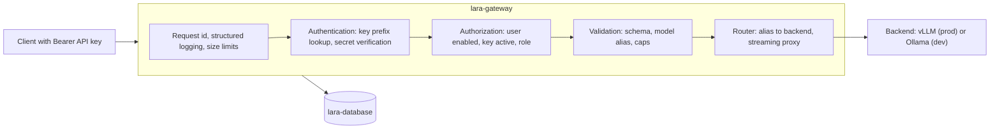

The router is deliberately thin. It resolves an alias to a backend and relays bytes. Client-specific behaviour never enters the gateway (**PRD REQUIREMENT** 6.2).

## Implementation Tasks

### 1. Service skeleton

1. FastAPI application with a settings module that reads configuration from the environment only. No secret is ever a default value in code.
2. Structured JSON logging with a per-request id, emitted on every request and returned as `X-LARA-Request-Id`.
3. Request-size limit middleware. Agentic prompts are large; unbounded ones are a denial-of-service vector.
4. Compose service on `lara_core` and `lara_edge`, published only to loopback.

### 2. Database and migrations

1. PostgreSQL container on `lara_core`, no published ports in prod, persistent named volume.
2. SQLAlchemy models and Alembic migrations for the Session 3 entities (full field list in section 21).
3. Seed script: roles with default priorities, the owner user, and `inference_backends` rows for `vllm-prod` and `ollama-dev`.
4. Compose healthcheck on the database, with the gateway depending on it being healthy.

### 3. Users and roles

| Capability | Endpoint | Notes |
| --- | --- | --- |
| Create user | `POST /admin/users` | Manual provisioning only. No open registration (**PRD REQUIREMENT** 4.2). |
| List and read users | `GET /admin/users`, `GET /admin/users/{id}` | Never returns key secrets or password hashes |
| Enable or disable | `PATCH /admin/users/{id}` | Disabled users are denied even with a valid key |
| Assign role | `PATCH /admin/users/{id}` | Role determines scheduling priority from Session 4 |

Passwords are only required if the administrative or user portal is used; API clients authenticate with keys. **ENGINEERING RECOMMENDATION:** hash passwords with Argon2id or bcrypt. Password login is not required for V1 inference to work, so keep the portal minimal.

### 4. API keys

**PRD REQUIREMENT** (PRD 11.2, 11.3): securely generated, shown once, stored hashed, revocable, individually identifiable, bound to one user.

Key format, **ENGINEERING RECOMMENDATION**:

```text
lara_<key_id>_<secret>

key_id   short random identifier, stored in plaintext, unique, indexed
secret   high-entropy random value from a cryptographic RNG, never stored
```

Verification path: parse the prefix, look up by `key_id`, verify the presented secret against the stored hash in constant time, reject if `revoked_at` is set or the owning user is disabled.

**Engineering Note.** Use a fast keyed hash such as HMAC-SHA256 with a server-side pepper for API keys, not a deliberately slow password KDF. The secret already has full entropy, so a slow KDF adds latency to every single inference request without adding meaningful protection. Use the slow KDF for human passwords, where entropy is low. The pepper lives in `LARA_API_KEY_PEPPER` and rotating it invalidates all keys, which must be documented as a deliberate operational action.

Other rules:

1. The full key is returned exactly once, at creation, and never again.
2. Raw keys never appear in logs, error messages, audit rows, or diagnostic endpoints. Log `key_id` only.
3. `last_used_at` is updated on use. **ENGINEERING RECOMMENDATION:** update it at a coarse granularity, such as at most once per minute per key, so that key usage does not add a write to every request.
4. Revocation takes effect immediately, with no cache that could keep a revoked key alive.

### 5. Authorization

Authentication answers "who is this". Authorization answers "may they proceed", and is checked separately (**PRD REQUIREMENT** 4.4) against: user enabled, key not revoked, role permits the endpoint, mode admission policy (Session 5), and service availability.

| Condition | Response | Body |
| --- | --- | --- |
| No or malformed `Authorization` header | `401` | error, no detail about what was wrong |
| Unknown `key_id` | `401` | identical shape to the above |
| Bad secret | `401` | identical shape |
| Revoked key | `401` | identical shape |
| Disabled user | `403` | account disabled |
| Valid key, insufficient role for an admin endpoint | `403` | insufficient privileges |

**ENGINEERING RECOMMENDATION.** Keep all authentication failures indistinguishable to the caller. Distinguishing "unknown key" from "wrong secret" leaks information to an enumerating attacker.

### 6. Model resolution

1. `GET /v1/models` returns LARA aliases from the `models` table where `enabled = true`, not raw backend model ids (**PRD REQUIREMENT** 7.3).
2. Inference requests carry an alias in `model`. The gateway resolves alias to backend plus real model id.
3. Unknown or disabled alias returns `404` with the list of valid aliases.
4. If `model` is omitted, use the configured default alias.

### 7. Proxy behaviour

1. Non-streaming: forward, await, relay status and body, record the outcome.
2. Streaming: forward with streaming enabled, relay chunks as they arrive without buffering the whole response, propagate client disconnect upstream so the backend can stop generating.
3. Never alter token content. Add LARA metadata as headers only.
4. Use an explicit connect timeout, a first-token timeout, and a total timeout (section 5.2.2).
5. Use one long-lived HTTP client with a connection pool rather than a new connection per request.

### 8. Health and status

| Endpoint | Auth | Purpose | Content rule |
| --- | --- | --- | --- |
| `GET /health` | none | Liveness for Compose and the tunnel | Minimal. No version, no internals, no dependency detail |
| `GET /status` | API key | Operational state for authenticated users | Backend reachable, active model alias, current mode, active and queued job counts from Session 4 |

**PRD REQUIREMENT** (PRD 16.4): diagnostic endpoints never return secrets. `/health` in particular is unauthenticated and reachable through the tunnel in Session 6, so it must reveal nothing beyond liveness.

## Repository Changes

```text
gateway/
├── Dockerfile
├── requirements.txt              (pinned versions)
└── app/
    ├── main.py
    ├── config.py                 (environment-only settings)
    ├── auth/                     (key generation, verification, dependencies)
    ├── api/
    │   ├── v1/                   (public OpenAI-compatible surface)
    │   ├── lara/                 (LARA extensions: /status, later /queue, /me)
    │   └── admin/                (users, keys, backends, models)
    ├── models/                   (registry and backend adapters)
    ├── users/
    └── monitoring/               (health, status)

database/
├── migrations/                   (Alembic)
└── seed/                         (roles, owner, backends, initial model rows)

docs/security/auth.md
tests/unit/, tests/integration/   (auth and proxy suites)
compose.yaml                      (lara-gateway and lara-database added)
```

## Interfaces

Full reference in section 20. Introduced here:

| Method | Path | Auth | Purpose |
| --- | --- | --- | --- |
| `GET` | `/v1/models` | API key | List enabled aliases |
| `POST` | `/v1/chat/completions` | API key | Inference, streaming and non-streaming |
| `POST` | `/v1/responses` | API key | Pass through if the backend supports it, otherwise a clear unsupported error |
| `GET` | `/health` | none | Liveness |
| `GET` | `/status` | API key | Operational state |
| `POST` | `/admin/users` | admin role | Create user |
| `GET/PATCH` | `/admin/users/{id}` | admin role | Read, enable, disable, set role |
| `POST` | `/admin/users/{id}/api-keys` | admin role | Issue a key, returned once |
| `DELETE` | `/admin/api-keys/{key_id}` | admin role | Revoke |
| `GET` | `/admin/models` | admin role | Registry contents |

## Data Flow

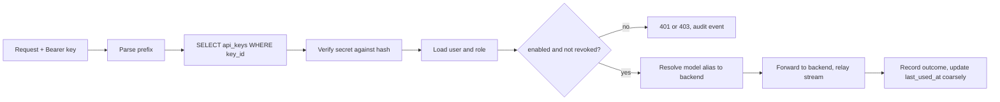

Persisted: user, role, key metadata, backends, models, audit events, and request outcome records. Not persisted: prompts, responses, or any message content (**PRD REQUIREMENT** 12.4).

## Configuration

| Key | Purpose | Notes |
| --- | --- | --- |
| `DATABASE_URL` | PostgreSQL connection | secret, never committed |
| `POSTGRES_USER`, `POSTGRES_PASSWORD`, `POSTGRES_DB` | database bootstrap | secret |
| `LARA_API_KEY_PEPPER` | server-side pepper for key hashing | secret; rotating it invalidates all keys |
| `LARA_JWT_SECRET` | portal sessions if a portal exists | secret; omit if unused |
| `LARA_DEFAULT_BACKEND` | `vllm-prod` or `ollama-dev` | selects the backend row |
| `LARA_DEFAULT_MODEL_ALIAS` | used when the client omits `model` | must exist and be enabled |
| `LARA_MAX_REQUEST_BYTES` | request-size cap | protects against oversized prompts |
| `LARA_CONNECT_TIMEOUT_S`, `LARA_TTFT_TIMEOUT_S`, `LARA_REQUEST_TIMEOUT_S` | upstream timeouts | see section 5.2.2 |
| `LARA_LOG_LEVEL` | log verbosity | never `debug` in production by default |
| `LARA_TRANSCRIPT_LOGGING` | prompt and response capture | **default false** (PRD 12.4) |

## Security Considerations

1. `lara-gateway` is the only service on both networks. Nothing else may be on `lara_edge`.
2. `lara-database` publishes no port in production.
3. API keys stored as hashes with a pepper; raw keys never logged or re-displayed.
4. Uniform authentication failures; no user enumeration.
5. Request size limits and strict schema validation on every public endpoint.
6. Audit events for user creation, role change, enable and disable, key issue, and key revoke, with actor, target, timestamp, and source address. Never the key itself.
7. Secrets only from the environment. `.env` is git-ignored and `.env.example` contains no real values.
8. The gateway authenticates to the backend where the backend supports it (PRD 11.5). Where the backend has no authentication, network isolation is the control, which is exactly why `lara_core` is `internal: true`.
9. Trust boundary statement for `docs/security/`: everything inside `lara_core` is trusted; everything arriving at the gateway is untrusted, including traffic from the campus LAN.

## Failure Modes

| Failure | Behaviour | Client sees |
| --- | --- | --- |
| Database unreachable at boot | Gateway fails its healthcheck and does not serve traffic | connection refused or unhealthy |
| Database lost while running | Requests that need identity fail closed. **ENGINEERING RECOMMENDATION:** never fall back to allowing unauthenticated inference | `503` |
| Backend unreachable | Marked unhealthy in `/status`, requests fail fast | `502` |
| Backend slow, no first token | Aborted at `LARA_TTFT_TIMEOUT_S` | `504` |
| Client disconnects mid-stream | Upstream request cancelled, outcome recorded | connection closed |
| Malformed JSON or bad schema | Rejected before any backend call | `400` with field detail |
| Oversized request | Rejected at the middleware | `413` |
| Unknown model alias | Rejected before any backend call | `404` with valid aliases |
| Migration mismatch | Gateway refuses to start | fails healthcheck |
| Pepper missing or changed | All key verification fails | `401` for everyone, alarming and obvious by design |

## Testing

| ID | Test | Pass criterion |
| --- | --- | --- |
| T-S3-01 | Valid key | `200` and a completion |
| T-S3-02 | Missing header | `401` |
| T-S3-03 | Malformed key | `401`, same shape as T-S3-02 |
| T-S3-04 | Unknown `key_id` | `401`, same shape |
| T-S3-05 | Correct prefix, wrong secret | `401`, same shape |
| T-S3-06 | Revoked key | `401` immediately after revocation, no cache window |
| T-S3-07 | Disabled user with a valid key | `403` |
| T-S3-08 | Non-admin calling an admin endpoint | `403` |
| T-S3-09 | Key stored hashed | Direct database inspection shows no raw secret anywhere |
| T-S3-10 | Keys absent from logs | Grep the full log output for a known raw key; zero hits |
| T-S3-11 | `/v1/models` | Returns aliases, not backend model ids |
| T-S3-12 | Streaming through the gateway | Chunks arrive incrementally end to end |
| T-S3-13 | Client disconnect | Upstream generation stops, outcome recorded |
| T-S3-14 | Unknown alias | `404` with the valid alias list |
| T-S3-15 | Oversized request | `413`, never forwarded |
| T-S3-16 | Backend down | `502`, `/status` reflects it, gateway stays up |
| T-S3-17 | Direct backend reachability from the LAN | Refused. This is the session's most important negative test |
| T-S3-18 | Database port reachability from the LAN | Refused |
| T-S3-19 | Transcript logging default | No prompt or response content in any log or table |
| T-S3-20 | Migrations from empty | `alembic upgrade head` on a clean database succeeds and seeds |

## Acceptance Criteria

- [ ] Authenticated clients reach inference through the gateway.
- [ ] Invalid, revoked, and disabled cases are all denied, indistinguishably where appropriate.
- [ ] API keys are hashed with a pepper and appear nowhere in plaintext.
- [ ] `/v1/models` returns aliases, and alias resolution works.
- [ ] Streaming and non-streaming both work end to end.
- [ ] `/health` and `/status` behave per the content rule.
- [ ] Admin endpoints are separate from the public surface and role-protected.
- [ ] Backend and database are unreachable from outside the private network.
- [ ] Migrations run from empty and seed correctly.
- [ ] Prompts and responses are not stored.

## Exit Gate

**Session 4 may not begin until:**

1. This works:

```text
Client -> authenticated lara-gateway -> private backend
```

2. And this does not:

```text
LAN or Internet -> inference backend, or -> PostgreSQL
```

3. Every authentication and authorization case in the testing table passes.
4. A coding agent works through the gateway with a real API key.
5. Audit events are recorded for administrative actions.
6. The exit gate is signed and dated.

At this point LARA has no concurrency control. It is a secure pass-through, and a burst of agent traffic can overwhelm the GPU. That is what Session 4 fixes, and it is the reason Session 4 follows immediately.
---

# Session 4 — Queue and Scheduler

## Objective

Turn the gateway into a resource-aware inference scheduler: three active jobs, a priority queue for everything else, graceful cancellation, and a durable record of every job.

## Why This Session Exists

This is the most important engineering session in the project. The PRD's central constraint is that one 16 GB GPU must behave like a reliable shared service (PRD 3.3, 9.1). A single agentic task can generate dozens of inference calls, so twelve concurrent users can produce a request rate far above what the GPU can serve safely. Without admission control, the failure mode is not a queue: it is VRAM exhaustion, thrashing, and a workstation that becomes unusable for its owner.

Queueing is also a product decision (PRD 9.2): the fourth request waits rather than receiving an error.

## Prerequisites

1. Session 3 exit gate closed.
2. Jobs can reach a backend through the authenticated gateway.
3. Streaming relay verified, including client-disconnect propagation.

## Deliverables

1. In-process scheduler with a hard ceiling of `LARA_MAX_ACTIVE_JOBS`, default 3.
2. Priority queue with FIFO ordering inside equal priority.
3. Full job lifecycle persisted in the `jobs` table.
4. Cancellation, both client-initiated and administrative.
5. Restart reconciliation.
6. Queue visibility endpoints.
7. Load tests demonstrating the 3-running / N-queued behaviour.

## Architecture

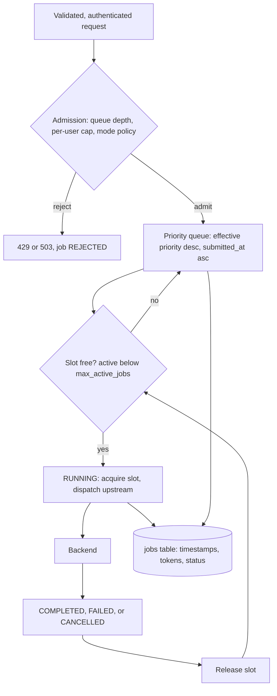

**ENGINEERING RECOMMENDATION: one process, in-memory scheduler, durable job records.** The scheduler state (slots and the waiting set) lives in the gateway process; the job history lives in PostgreSQL. This is correct for a single-node, roughly twelve-user, 3-slot service and it introduces no new infrastructure (PRD 1.3 principle 13).

**The constraint this creates must be written into the code and the README:** the gateway runs as a single worker process. Multiple uvicorn workers would each hold their own semaphore, silently multiplying the ceiling by the worker count. This is the most likely way for a future contributor to break the GPU safety property without noticing. If multiple processes ever become necessary, the correct fix is a shared counter in PostgreSQL using advisory locks, not Redis (section 6.1).

## Implementation Tasks

### 1. Job records

Create the `jobs` row at `RECEIVED`, before admission, so that rejections are countable. Field list in section 21.4. Record, at minimum: request id, user, key id, model alias, resolved backend, mode at submission, effective priority, `queued_at`, `started_at`, `completed_at`, status, token counts where available, and error class.

Derived fields to store rather than recompute: `queue_wait_ms` and `generation_ms`. Analytics in Session 7 read these constantly.

### 2. Slot control

1. A single asynchronous semaphore with `max_active_jobs` permits.
2. Acquire before dispatching upstream; release in a `finally` path that cannot be skipped by any exit route, including cancellation and exception.
3. The effective ceiling is `min(LARA_MAX_ACTIVE_JOBS, mode.max_active_jobs, pressure_adjusted_max)`. In Session 4 the last two are constants; Session 5 makes them live.
4. Expose the current active count and queue depth in memory, and reflect them in `/status`.

### 3. Priority queue

1. Ordering key: effective priority descending, then `submitted_at` ascending. Effective priority is computed once at enqueue and stored on the job (section 5.4).
2. On slot release, select the highest-priority waiting job and wake exactly that waiter.
3. `per_user_max_active` is checked at admission and at promotion, so a single user cannot occupy every slot.

### 4. Cancellation

| Trigger | Detection | Effect |
| --- | --- | --- |
| Client disconnect while queued | ASGI disconnect signal, checked while waiting | Remove from queue, `CANCELLED` |
| Client disconnect while running | Disconnect propagated to the upstream call | Abort upstream, release slot, `CANCELLED` |
| User cancels own job | `POST /lara/jobs/{request_id}/cancel` | Same as above, ownership enforced |
| Admin cancels any job | `POST /admin/jobs/{request_id}/cancel` | Same, audited |

Aborting the upstream call matters: without it, the GPU keeps generating tokens nobody will read, which is exactly the waste the 3-slot ceiling exists to prevent.

### 5. Timeouts

Implement all four bounds from section 5.2.2: queue timeout, connect timeout, first-token timeout, total generation timeout. Every one has a distinct error class so the Session 7 analytics can tell "the queue was long" apart from "the model stalled".

### 6. Restart reconciliation

On boot, before accepting traffic, close any `QUEUED` or `RUNNING` jobs left by a previous process as `FAILED` with `error_class=gateway_restart` (section 5.2.4).

### 7. Queue visibility

| Method | Path | Auth | Returns |
| --- | --- | --- | --- |
| `GET` | `/lara/queue` | API key | Active count, queue depth, effective ceiling, current mode, the caller's own waiting jobs and positions |
| `GET` | `/lara/jobs/{request_id}` | API key, owner only | Status, timestamps, waits, token counts. Never content |
| `POST` | `/lara/jobs/{request_id}/cancel` | API key, owner only | Cancels |
| `GET` | `/admin/jobs` | admin role | All jobs, filterable by status, user, model, time |
| `POST` | `/admin/jobs/{request_id}/cancel` | admin role | Cancels any job, audited |

**ENGINEERING RECOMMENDATION.** A user sees their own queue position and never other users' identities or job details. The leaderboard in Session 7 is the only place identity is shown, and only in a display form.

### 8. Streaming plus queueing

Apply section 5.2.3: for `stream=true`, flush headers and emit SSE comment keepalives while queued; for `stream=false`, hold the connection until the queue timeout. Re-verify each target coding agent tolerates the keepalive form, because the client that worked in Session 2 was never queued in Session 2.

## Repository Changes

```text
gateway/app/scheduler/
├── queue.py           (priority ordering, waiting set)
├── slots.py           (semaphore, effective ceiling)
├── lifecycle.py       (state transitions, persistence)
├── cancellation.py    (disconnect detection, upstream abort)
└── reconcile.py       (restart cleanup)

gateway/app/api/lara/  (queue and job endpoints)
gateway/app/api/admin/ (job administration)
database/migrations/   (jobs table and indexes)
tests/load/            (concurrency and queue scenarios)
docs/architecture/scheduler.md
```

## Interfaces

Behavioural contract, which matters more than the endpoint list:

1. Under the ceiling, a request is dispatched with no added latency beyond authentication and validation.
2. At the ceiling, a request waits. It does not receive an error (PRD 9.2).
3. At `queue_max_depth`, a request is rejected with `429`, not queued indefinitely.
4. Promotion order is deterministic and explainable from stored fields: given the job table, anyone can reconstruct why job B ran before job A.

## Data Flow

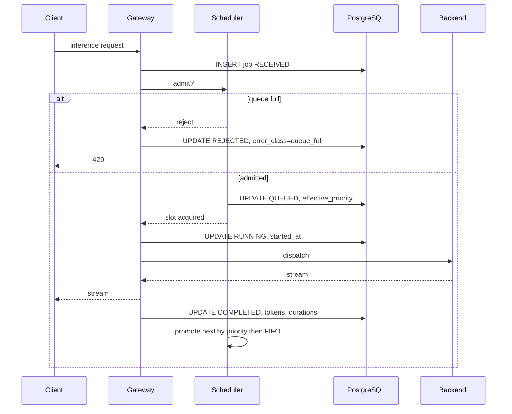

## Configuration

| Key | Default | Purpose |
| --- | --- | --- |
| `LARA_MAX_ACTIVE_JOBS` | `3` | **PRD REQUIREMENT.** Global GPU ceiling |
| `LARA_QUEUE_MAX_DEPTH` | configurable | Backpressure boundary |
| `LARA_QUEUE_TIMEOUT_S` | configurable | Maximum wait before failing a queued job |
| `LARA_PER_USER_MAX_ACTIVE` | `1` | Anti-monopolization; overridden per mode |
| `LARA_TTFT_TIMEOUT_S` | configurable | First-token bound |
| `LARA_REQUEST_TIMEOUT_S` | configurable | Total generation bound |
| `LARA_SSE_KEEPALIVE_S` | configurable | Queue keepalive interval for streaming clients |

All defaults are seeds and are **NOT YET MEASURED**. Real values come from Session 7 benchmarks. Note that `LARA_QUEUE_TIMEOUT_S` interacts with agent behaviour: an agent that retries aggressively on timeout can amplify load, so tune it with the agent's retry policy in view.

## Security Considerations

1. Queue and job endpoints enforce ownership. A user cannot read, cancel, or infer the existence of another user's jobs.
2. Job records contain no prompt or response content.
3. Queue depth is a mild information leak about service load. That is acceptable and useful; per-user detail is not exposed.
4. Rejections are logged with the user id so that abuse patterns are visible in Session 6.
5. Administrative cancellation is audited with actor and target.

## Failure Modes

| Failure | Consequence if unhandled | Required handling |
| --- | --- | --- |
| Exception between slot acquisition and release | Permanent slot leak; ceiling silently drops to 2, then 1, then 0 | Release in `finally`; assert active count matches running jobs periodically |
| Client disconnect not detected | Slot held for a stream nobody reads | Explicit disconnect detection in both waiting and streaming paths |
| Backend hangs with no tokens | Slot held indefinitely | First-token timeout |
| Backend trickles tokens forever | Slot held for hours | Total generation timeout |
| Gateway restart mid-queue | Jobs stuck `RUNNING` forever in the table | Reconciliation on boot |
| Multiple worker processes | Real ceiling becomes 3 x workers, GPU oversubscribed | Enforce single worker; log the effective ceiling at startup |
| Priority inversion or starvation | Low-priority users never served | `per_user_max_active`, plus p95 wait by role in Session 7 analytics |
| Queue grows without bound | Memory growth and meaningless waits | `queue_max_depth` and `queue_timeout` |
| Clock skew or non-monotonic time | Unstable FIFO ordering | Use a monotonic sequence number as the tiebreaker, not wall-clock alone |

## Testing

| ID | Test | Method | Pass criterion |
| --- | --- | --- | --- |
| T-S4-01 | Ceiling holds | 10 simultaneous valid requests | Exactly 3 `RUNNING`, 7 `QUEUED` |
| T-S4-02 | Queue drains | Same, wait for completion | All 10 reach a terminal state, none stuck |
| T-S4-03 | Promotion on completion | 4 requests, observe transition | Fourth moves to `RUNNING` when one completes |
| T-S4-04 | Priority ordering | Queue several low-priority, then submit high-priority | High-priority runs before earlier low-priority jobs |
| T-S4-05 | FIFO within priority | Multiple same-priority requests | Served in submission order |
| T-S4-06 | Per-user cap | One user submits 5 | Fewer slots held than the global ceiling, others still get service |
| T-S4-07 | Cancel while queued | Cancel a waiting job | `CANCELLED`, never dispatched |
| T-S4-08 | Cancel while running | Cancel a streaming job | Upstream aborted, slot released within a bounded interval |
| T-S4-09 | Disconnect while queued | Kill the client | `CANCELLED`, no dispatch |
| T-S4-10 | Disconnect while running | Kill the client mid-stream | Upstream aborted, slot released |
| T-S4-11 | Queue timeout | Set a low timeout, overload | `503`, `error_class=queue_timeout` |
| T-S4-12 | Queue full | Exceed `queue_max_depth` | `429`, `error_class=queue_full` |
| T-S4-13 | Slot-leak soak | Sustained mixed traffic including failures and cancellations | Active count returns to 0 at idle; no downward drift in the ceiling |
| T-S4-14 | Restart reconciliation | Restart mid-queue | No job left `QUEUED` or `RUNNING`; counts start clean |
| T-S4-15 | Backend failure | Stop the backend under load | Running jobs `FAILED`, slots released, gateway stays up |
| T-S4-16 | Streaming while queued | Streaming client behind a full queue | Client survives the wait and receives the full stream |
| T-S4-17 | Agent under contention | Run a coding agent while the queue is loaded | Agent completes without malformed streams or spurious retries |
| T-S4-18 | Job record completeness | Inspect rows after the suite | Every terminal job has timings, status, and error class where applicable; no content |

T-S4-13 and T-S4-14 are the two tests that catch the failures which would otherwise appear weeks later as "the service gets slower over time".

## Acceptance Criteria

- [ ] Exactly 3 jobs run concurrently; the rest queue.
- [ ] Queued jobs execute as slots free.
- [ ] Priority ordering works, with FIFO inside equal priority.
- [ ] Per-user active cap prevents monopolization.
- [ ] Cancellation works from queue and from running, by owner and by admin.
- [ ] Client disconnect frees the slot and aborts upstream.
- [ ] All four timeouts fire with distinct error classes.
- [ ] Restart reconciliation leaves no orphaned jobs.
- [ ] Soak test shows no slot leak.
- [ ] Job records are complete and content-free.
- [ ] Effective ceiling is logged at startup and matches configuration.

## Exit Gate

**Session 5 may not begin until:**

1. The 10-request test yields 3 running and 7 queued, and all 10 finish.
2. Priority and FIFO behaviour is demonstrated and reconstructable from the job table.
3. Cancellation and disconnect release slots and abort upstream generation.
4. The soak test shows no slot leak.
5. A real coding agent works normally while the queue is under load.
6. The exit gate is signed and dated.

Session 5 makes the ceiling and the caps dynamic. Making them dynamic before they are provably correct as constants would mean debugging the policy engine and the scheduler at the same time.
---

# Session 5 — Operating Modes and Model Management

## Objective

Implement the three operating modes as live resource policy, and make the model fully configuration-driven so it can be replaced without touching application code.

## Why This Session Exists

Two capabilities that look unrelated belong in the same session because they share one mechanism: configuration that changes runtime behaviour without a code change.

The modes exist because the workstation has a second life. It is a personal development machine and a game-development machine as well as a campus service (PRD 8). Game Dev Mode in particular is a resource policy, not a cosmetic setting (PRD Appendix D rule 13).

The model registry exists because the PRD refuses to freeze a model (PRD 7.3, 7.5) and the master task makes plug-and-play replacement a core requirement. The test of this session is simple: swapping the model must not require rewriting authentication, users, keys, the queue, the scheduler, priorities, modes, analytics, the database, client integrations, or the public API contract.

## Prerequisites

1. Session 4 exit gate closed.
2. Scheduler ceiling proven correct as a constant.
3. GPU telemetry sampling available at least in prototype form, since Game Dev Mode consumes it. Full telemetry productionization is Session 7.

## Deliverables

1. Mode engine with three modes, persisted current state, audited transitions.
2. GPU pressure evaluator feeding admission decisions in Game Dev Mode.
3. Model registry in the database with logical aliases mapped to backends and real model ids.
4. Model configuration files as the source of truth for runtime arguments.
5. Safe model-switch procedure, scripted and documented.
6. `scripts/mode.sh` and `scripts/model.sh`.

## Architecture

### Diagram 7: model configuration and registry

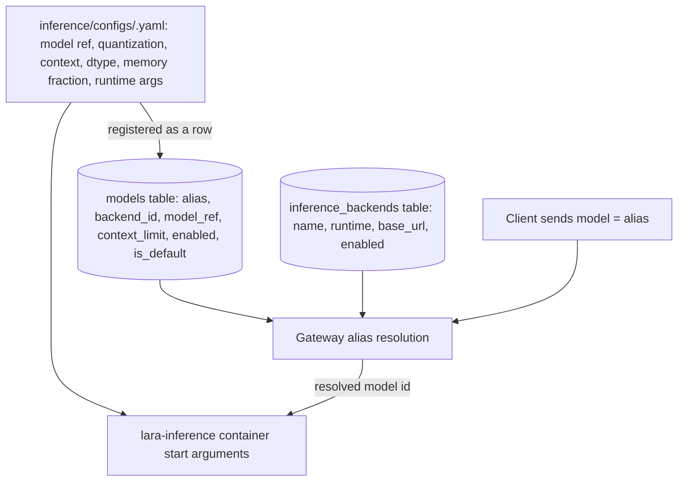

Two sources of truth, deliberately separated and kept consistent by the switch runbook:

1. The **config file** decides how the runtime is started. Only the runtime reads it.
2. The **registry row** decides what clients may ask for and where it routes. Only the gateway reads it.

**Engineering Note.** These can drift: a registry row can advertise an alias whose model is not the one currently loaded. Two defences: the switch runbook updates both in one operation, and the gateway's startup health check compares each enabled alias against the backend's `/v1/models`, disabling any alias the backend does not actually serve and logging the mismatch loudly.

### Diagram 10: model switching workflow

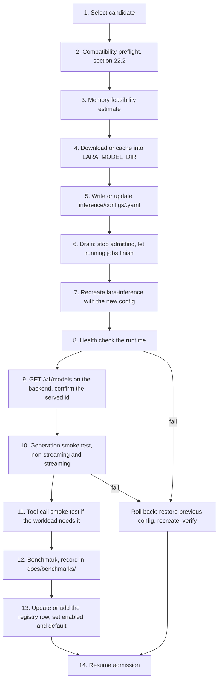

## Implementation Tasks

### 1. Mode engine

1. Store the current mode as a single-row table with `mode`, `changed_at`, `changed_by`. Transitions write an audit event (**PRD REQUIREMENT** 8.4).
2. Mode policy fields per section 5.3.2, loaded from configuration, not branched in code. A new mode should be a row plus configuration, not a new `if`.
3. Admission consults the active mode for: effective `max_active_jobs`, `per_user_max_active`, context and output caps, priority bonuses, and whether the pressure policy is active.
4. Mode changes never kill running jobs (**PRD REQUIREMENT** 8.2). They change what is admitted next.
5. Endpoints: `GET /admin/mode`, `POST /admin/mode`. `scripts/mode.sh serving|personal|gamedev` wraps them.

### 2. Priority in Personal Coding Mode

The owner's effective priority gains `owner_priority_bonus` while the mode is active. Campus jobs already running finish normally. The owner takes the next free slot rather than preempting one. If measurement later shows the owner waits unacceptably long, that is a PRD amendment, not an implementation shortcut.

### 3. GPU pressure evaluator

1. Sample GPU utilization, VRAM used and total, and temperature at `LARA_GPU_SAMPLE_INTERVAL_S`.
2. Maintain a rolling window and derive a pressure level from the median, not the latest sample, so a single frame spike cannot pause the service.
3. Compute VRAM used outside the inference reservation as the proxy for external GPU consumers (section 5.3.3).
4. Map to `LOW`, `MODERATE`, `HIGH`, `CRITICAL` using configurable thresholds. Seed values are provisional and marked **NOT YET MEASURED** in `.env.example`.
5. Apply hysteresis: require the level to hold for a configurable number of consecutive evaluations before acting, and use a lower threshold to exit a level than to enter it. Without hysteresis the service oscillates between paused and running.
6. Effects by level, in Game Dev Mode only:

| Level | Effect on new work | Effect on running work |
| --- | --- | --- |
| `LOW` | normal admission | none |
| `MODERATE` | reduced effective ceiling, reduced context and output caps | none |
| `HIGH` | admit nothing, arrivals queue | none |
| `CRITICAL` | admit nothing, queue holds | running jobs still allowed to finish |

7. Every level transition is logged with the sample values that caused it, so behaviour can be explained afterwards.

**Engineering Note / Potential Revision, repeated because it is the crux of Game Dev Mode.** vLLM reserves VRAM at container start, so admission control cannot return VRAM to a game engine. The two honest levers are admission control and an explicit restart of `lara-inference` with a smaller memory fraction using a dedicated `gamedev` model profile. Document the second as an operator action in `docs/operations/gamedev.md`, including its service interruption. Do not implement or imply continuous VRAM rebalancing.

### 4. Model registry

Registry fields (full schema in section 21.5): `alias`, `backend_id`, `model_ref`, `quantization`, `context_limit`, `max_output_default`, `enabled`, `is_default`, `config_file`, `notes`.

Rules:

1. Clients only ever see aliases (**PRD REQUIREMENT** 7.3, master task 10). No filesystem path or repository id is exposed through the public API.
2. Aliases such as `campus-coder`, `campus-reasoner`, `campus-general` are examples from the PRD, not mandatory names, and no alias is hard-coded in application logic.
3. `GET /v1/models` returns enabled aliases only.
4. A disabled alias returns `404` with the valid list. A request for an alias whose backend is down returns `503`.
5. Admin endpoints manage registry rows: `GET/POST /admin/models`, `PATCH /admin/models/{alias}`.

### 5. Model configuration files

One file per model profile under `inference/configs/`, containing only arguments the pinned runtime accepts (section 22.3): model reference, quantization, maximum sequence length, dtype where applicable, GPU memory fraction, and any runtime-specific serving flags such as the served model name and tool-call parser options.

**PRD REQUIREMENT** (master task 9, 35): do not invent configuration fields to look thorough. Every field must map to a real argument of the pinned runtime version.

A `gamedev` variant profile is expected: same model, smaller memory fraction and shorter maximum sequence length, for use when the workstation is doing game development for an extended period.

### 6. Model switching

Implement diagram 10 as `scripts/model.sh`, with drain, recreate, verify, and roll back. Behaviour during a switch:

| Population | Behaviour |
| --- | --- |
| Running jobs | Allowed to finish during drain, up to `LARA_DRAIN_TIMEOUT_S`, then failed with `error_class=drain_timeout` |
| Queued jobs | Held, not failed, if the switch completes within the queue timeout; otherwise they fail with `queue_timeout` |
| Arriving requests | Rejected with `503` and a retry hint while `switching` |
| Streams in flight | Terminated only if drain times out |
| Registry | Old alias disabled or repointed only after the new model passes its smoke test |
| Failure at any step | Roll back to the previous config and verify service restored before investigating |

`/status` reports a `switching` state so clients and the operator can see why requests are refused.

## Repository Changes

```text
gateway/app/
├── scheduler/policy.py        (mode policy application in admission)
├── modes/                     (mode state, transitions, pressure evaluator)
└── models/registry.py         (alias resolution, health reconciliation)

inference/configs/<name>.yaml            (per-model profiles, plus gamedev variants)
scripts/mode.sh
scripts/model.sh
database/migrations/                     (operating_mode, models, backends changes)
docs/operations/model-switch.md
docs/operations/gamedev.md
```

## Interfaces

| Method | Path | Auth | Purpose |
| --- | --- | --- | --- |
| `GET` | `/admin/mode` | admin | Current mode, policy in effect, current pressure level |
| `POST` | `/admin/mode` | admin | Set mode, audited |
| `GET` | `/admin/models` | admin | Registry rows including disabled |
| `POST` | `/admin/models` | admin | Add a registry row |
| `PATCH` | `/admin/models/{alias}` | admin | Enable, disable, set default, repoint |
| `GET` | `/v1/models` | API key | Enabled aliases only |
| `GET` | `/status` | API key | Adds current mode, active model alias, and `switching` state |

## Data Flow

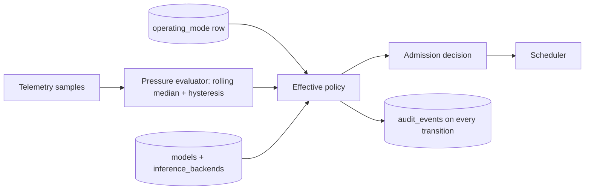

## Configuration

| Key | Purpose |
| --- | --- |
| `LARA_MODE_DEFAULT` | Mode applied on a clean deployment |
| `LARA_GPU_SAMPLE_INTERVAL_S` | Telemetry sampling period |
| `LARA_PRESSURE_WINDOW_SAMPLES` | Rolling window length |
| `LARA_PRESSURE_HYSTERESIS_SAMPLES` | Consecutive samples required to change level |
| `LARA_PRESSURE_VRAM_MODERATE`, `_HIGH`, `_CRITICAL` | VRAM thresholds, **NOT YET MEASURED** |
| `LARA_PRESSURE_UTIL_MODERATE`, `_HIGH`, `_CRITICAL` | Utilization thresholds, **NOT YET MEASURED** |
| `LARA_PRESSURE_TEMP_CRITICAL` | Thermal ceiling, **NOT YET MEASURED** |
| `LARA_DRAIN_TIMEOUT_S` | Maximum drain wait during a model switch |
| `LARA_ACTIVE_MODEL_CONFIG` | Config file the inference service starts with |

Mode policy values live in configuration loaded at startup and re-readable through the admin API. Thresholds are set from measurement in Session 7, not from intuition in Session 5.

## Security Considerations

1. Mode changes are administrative and audited with actor, previous mode, new mode, and timestamp.
2. Model registry changes are administrative and audited. A user cannot select an unregistered model by sending a raw model id: unknown values are rejected, never forwarded.
3. The public API never exposes filesystem paths, repository ids, or runtime arguments.
4. Model files stay read-only to the inference container.
5. `switching` state must not leak internals in its error body. It says the service is switching models and when to retry, nothing more.

## Failure Modes

| Failure | Consequence | Handling |
| --- | --- | --- |
| Pressure evaluator flaps | Service pauses and resumes repeatedly | Rolling median plus hysteresis; log every transition with its inputs |
| Telemetry source unavailable | Pressure unknown | Fail safe: treat as `MODERATE` in Game Dev Mode, log an alert, never treat unknown as `LOW` |
| Thresholds set too aggressively | AI effectively unavailable during game development | Thresholds are configuration; retune from measurement |
| New model fails to load during a switch | Service down after drain | Automatic roll back to the previous config, then investigate |
| Registry points at a model the backend does not serve | Requests fail confusingly | Startup and post-switch reconciliation against backend `/v1/models`, disable and log mismatches |
| Drain never completes | Switch hangs | `LARA_DRAIN_TIMEOUT_S`, then fail remaining jobs explicitly |
| Two switches at once | Undefined state | A single switch lock; the second attempt is refused with a clear message |
| Mode set to a value with no policy row | Undefined admission behaviour | Validate against known modes, reject unknown values |

## Testing

| ID | Test | Pass criterion |
| --- | --- | --- |
| T-S5-01 | Serving mode baseline | Ceiling 3, normal priority ordering |
| T-S5-02 | Personal mode priority | Owner request takes the next free slot ahead of queued campus jobs |
| T-S5-03 | Personal mode non-preemption | Running campus jobs complete normally |
| T-S5-04 | Game Dev mode, low pressure | AI behaves normally |
| T-S5-05 | Game Dev mode, synthetic moderate pressure | Effective ceiling and caps reduce |
| T-S5-06 | Game Dev mode, synthetic high pressure | New work queues, running work continues |
| T-S5-07 | Game Dev mode, synthetic critical pressure | Admission paused, running work still finishes |
| T-S5-08 | Hysteresis | Oscillating input does not cause rapid level flapping |
| T-S5-09 | Telemetry loss | Pressure treated as `MODERATE`, alert logged |
| T-S5-10 | Mode transition audit | Every change produces an audit row with actor |
| T-S5-11 | Alias resolution | Client alias routes to the correct backend and model id |
| T-S5-12 | Disabled alias | `404` with the valid list |
| T-S5-13 | Raw model id | Rejected, never forwarded |
| T-S5-14 | Model switch happy path | Drain, recreate, health, smoke, registry update, resume, with recorded downtime |
| T-S5-15 | Model switch rollback | Deliberately break the new config; previous model restored automatically |
| T-S5-16 | Behaviour during switch | Queued jobs held or failed per specification; arrivals get `503` with retry hint |
| T-S5-17 | Registry reconciliation | A deliberately wrong registry row is disabled at startup and logged |
| T-S5-18 | **No-code-change proof** | Switch to a different model and run the full Session 3 and 4 suites with zero application code changes and zero client changes |

T-S5-18 is the acceptance test for the plug-and-play requirement. If any code change is required, document precisely why in `docs/operations/model-switch.md`, per master task 36.

## Acceptance Criteria

- [ ] Three modes implemented, persisted, and audited.
- [ ] Mode policy is configuration, not branching logic.
- [ ] Personal mode raises owner priority without preemption.
- [ ] Game Dev Mode reacts to observed GPU pressure, not to a fixed percentage.
- [ ] Hysteresis prevents flapping; telemetry loss fails safe.
- [ ] Registry maps aliases to backends and model ids; clients see aliases only.
- [ ] Model runtime arguments live in config files, not in code.
- [ ] Model switch runbook works, including rollback, with recorded downtime.
- [ ] Registry and backend reconcile at startup and after a switch.
- [ ] A model swap requires no application or client code change.

## Exit Gate

**Session 6 may not begin until:**

1. All three modes are demonstrated and audited.
2. Game Dev Mode has been exercised against synthetic pressure at every level. Validation against a real Unity or Unreal workload is a Session 7 item, and the exit gate records that it is still outstanding.
3. A full model switch has been performed and rolled back successfully, with downtime recorded.
4. T-S5-18 passes with no code change.
5. Sessions 3 and 4 suites still pass after the switch.
6. The exit gate is signed and dated.

Everything up to this point works locally. Session 6 adds the public transport, and only now is it safe to do so.
---

# Session 6 — Global Access and Security Hardening

## Objective

Make LARA reachable over HTTPS from anywhere, without asking university IT to open an inbound port, and prove that nothing except the gateway is exposed.

## Why This Session Exists

The workstation sits on university Wi-Fi and cannot depend on inbound routing, static port forwarding, firewall exceptions, or block-to-block routing (PRD 5.1). An outbound tunnel removes that dependency entirely: the workstation dials out, and the edge terminates HTTPS for clients.

It is deliberately late in the sequence. Attempting it earlier means debugging authentication, scheduling, mode policy, tunnelling, and DNS at the same time.

## Prerequisites

1. Session 5 exit gate closed.
2. Full stack works locally: authentication, queue, scheduler, modes, model registry.
3. A Cloudflare account. **UNKNOWN — MUST BE VERIFIED:** the exact free-tier capabilities, limits, and setup flow at implementation time. This document makes no claim about what a plan includes.

## Deliverables

1. `lara-cloudflared` running as an outbound tunnel.
2. A working public HTTPS endpoint, tested from at least three networks.
3. Abuse controls at the gateway.
4. Completed exposure audit with evidence.
5. `scripts/audit-ports.sh`, `docs/operations/tunnel.md`, `docs/security/exposure.md`.

## Architecture

### Diagram 6: network and security boundary

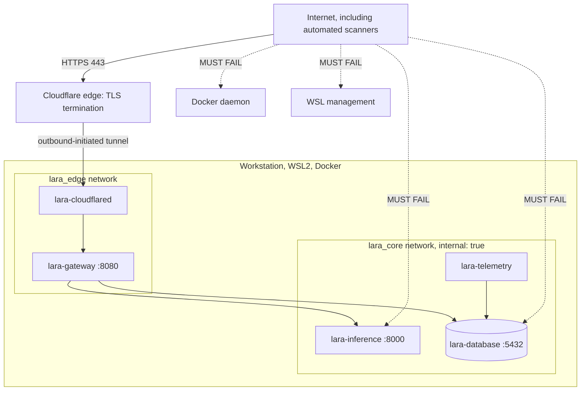

The dotted lines are not decoration. Each is a negative test in this session's suite.

## Implementation Tasks

### 1. Tunnel

1. Create the tunnel in the Cloudflare dashboard and obtain its credential.
2. Run `lara-cloudflared` in Docker on `lara_edge`, with the credential injected from the environment and never committed.
3. Configure the tunnel to route only to the gateway's port. No other origin service is routed, ever.
4. Verify the tunnel makes only outbound connections, and that no inbound port is opened on the workstation or the university network.
5. Pin the cloudflared image tag and record it.

### 2. Hostname strategy

**PRD-aligned requirement** (master task 21): a purchased domain must not be a hard dependency.

| Option | Cost | Requirement |
| --- | --- | --- |
| Provider-assigned hostname for a quick tunnel | ₹0 | Availability, stability, and persistence of such hostnames are **UNKNOWN — MUST BE VERIFIED**. Verify before depending on it for client configuration. |
| Custom domain routed through the provider | Domain registration cost only, and optional | Convenience, stable and memorable client configuration |

Document both. Core deployment must work without buying anything. If a hostname can change between restarts, that is a client-configuration problem worth knowing about in advance, so verify persistence explicitly and write the answer into `docs/operations/tunnel.md`.

### 3. External connectivity testing

Test from at least three positions:

1. Inside the university network.
2. Phone hotspot on a mobile network.
3. A different network entirely.

For each, verify: `GET /health` responds; `GET /v1/models` requires a key; an authenticated non-streaming completion works; an authenticated streaming completion works and streams incrementally rather than arriving as one buffered blob; a real coding agent completes a task end to end.

**Engineering Note.** Streaming through an intermediate edge is the most likely thing to behave differently than it did locally, because of buffering. Test it explicitly, and test it with a long generation, not a two-token reply.

### 4. Abuse controls

The public endpoint will receive automated scanning (PRD 16.1). Implement at the gateway:

| Control | Behaviour | Configuration |
| --- | --- | --- |
| Authentication enforcement | Every route except `/health` requires a key | n/a |
| Request-size limit | Reject oversized bodies before parsing | `LARA_MAX_REQUEST_BYTES` |
| Schema validation | Reject malformed requests before any backend call | n/a |
| Per-user concurrency | Already enforced by the scheduler | `per_user_max_active` |
| Queue depth cap | Backpressure rather than unbounded waiting | `LARA_QUEUE_MAX_DEPTH` |
| Request-rate protection | Per-key rate limit on request arrivals, not on tokens | `LARA_RATE_LIMIT_*` |
| Failed-authentication throttling | Slow or temporarily block sources producing repeated `401`s | `LARA_AUTH_FAIL_*` |
| Audit events | Record authentication failures, rejections, and rate-limit hits with source address | n/a |

**PRD REQUIREMENT** (PRD 9.6): no artificial monthly or daily token quotas. Rate protection limits request arrivals and abuse patterns, not a user's total useful work.

**ENGINEERING RECOMMENDATION.** Keep rate limiting in-process with a simple counter per key. It is a single gateway process, so this needs no external store. Do not introduce Redis for rate limiting.

### 5. Exposure audit

`scripts/audit-ports.sh` must check and record:

1. `docker compose ps` shows published ports only for the gateway, and only on loopback.
2. `lara-inference` has no `ports:` entry anywhere in `compose.yaml`.
3. `lara-database` has no published port in the production profile.
4. From another machine on the campus LAN, connections to the workstation's inference port, database port, and any monitoring port are refused.
5. The Docker daemon is not listening on TCP.
6. No WSL management interface is reachable from the network.
7. The public hostname serves only the gateway. Requests to any other path or port through the tunnel do not reach an internal service.

Evidence goes into `docs/security/exposure.md` with dates and the commands used. This audit is repeated as part of Session 7's V1 freeze.

### 6. Startup and resilience

1. Restart policies on all services.
2. The tunnel reconnects automatically after a network interruption. Test by disabling the network adapter for a period and restoring it.
3. Document the full boot chain: Windows starts, WSL2 starts, Docker starts, Compose brings the stack up, health checks pass, tunnel reconnects, service available (PRD 15.6). The exact Windows and WSL2 autostart mechanism is implementation work and must be recorded once chosen.

## Repository Changes

```text
compose.yaml                     (lara-cloudflared, tunnel profile)
gateway/app/api/                 (rate limiting and auth-failure throttling middleware)
scripts/audit-ports.sh
docs/operations/tunnel.md        (setup, hostname strategy, reconnection behaviour)
docs/security/exposure.md        (audit results with evidence)
docs/clients/                    (updated with the public base URL form)
tests/integration/               (external access and abuse-control suites)
```

## Interfaces

No new public application endpoints. What changes is reachability:

| Path | Before Session 6 | After Session 6 |
| --- | --- | --- |
| `/health` | loopback only | public, unauthenticated, minimal content |
| `/v1/*` | loopback only | public, API key required |
| `/lara/*` | loopback only | public, API key required |
| `/admin/*` | loopback only | **ENGINEERING RECOMMENDATION:** keep administrative routes off the public hostname where the tunnel configuration allows it. If they must be reachable, they remain role-protected, audited, and rate-limited. Document which choice was made. |

## Data Flow

```text
Client anywhere
  -> HTTPS to the public hostname
  -> Cloudflare edge terminates TLS
  -> existing outbound tunnel connection
  -> lara-cloudflared on lara_edge
  -> lara-gateway :8080
  -> authentication, authorization, validation, admission
  -> lara_core private network
  -> lara-inference
  -> RTX 5060 Ti
```

No inbound port is opened at any point in that chain.

## Configuration

| Key | Purpose | Notes |
| --- | --- | --- |
| `CLOUDFLARE_TUNNEL_TOKEN` | Tunnel credential | Secret. Never committed. Rotate if exposed |
| `LARA_PUBLIC_BASE_URL` | Client-facing base URL | Documentation and client guides only |
| `LARA_RATE_LIMIT_REQUESTS`, `LARA_RATE_LIMIT_WINDOW_S` | Per-key arrival rate | Tune with agent retry behaviour in view |
| `LARA_AUTH_FAIL_THRESHOLD`, `LARA_AUTH_FAIL_WINDOW_S`, `LARA_AUTH_FAIL_BLOCK_S` | Failed-authentication throttling | Protects against credential guessing |
| `LARA_TRUSTED_PROXY_HEADERS` | Which forwarded-for header to trust for client IP | Only trust it when traffic can arrive solely through the tunnel |

## Security Considerations

1. The tunnel does not replace authentication. It is transport. Every request still authenticates (PRD 4.5).
2. Only the gateway is routed. Never route the inference runtime, the database, or a monitoring UI.
3. The tunnel credential is a secret with the power to publish the origin. Treat it like a database password.
4. `/health` is public and unauthenticated, so it must reveal nothing: no version string, no dependency state, no model name.
5. Client IP is only meaningful if the forwarded header cannot be spoofed. Since all public traffic arrives through the tunnel, trust the header only on that path.
6. Error bodies never contain internal hostnames, stack traces, container names, or file paths.
7. Students receive an API key and a base URL. Nothing else (PRD 16.5).

## Failure Modes

| Failure | Consequence | Handling |
| --- | --- | --- |
| Tunnel disconnects | Service unreachable externally, locally unaffected | Restart policy plus automatic reconnection; verify by test |
| University network drops | Same | Reconnection on restore; recorded in the recovery runbook |
| Assigned hostname changes on restart | Every client's configuration breaks | Verify persistence before relying on it; if it can change, document the custom-domain option as the stable path |
| Streaming buffered at the edge | Agents appear to hang, then dump output | Detect with a long-generation streaming test; investigate before declaring the session done |
| Automated scanning traffic | Log noise, wasted cycles | Auth failure throttling, minimal error bodies, monitored audit events |
| Credential stuffing | Unauthorized access attempts | Individual keys, revocation, throttling, audit review |
| Rate limit too aggressive | Legitimate agents throttled mid-task | Tune against real agent behaviour, not against a guess |
| Tunnel routes more than intended | Internal service exposed | Exposure audit; hard fail of the exit gate |
| Leaked API key | Unauthorized use | Revoke the key, not the service; per-user keys make this contained and cheap |

## Testing

| ID | Test | Pass criterion |
| --- | --- | --- |
| T-S6-01 | Public `/health` | Reachable over HTTPS from outside, minimal body |
| T-S6-02 | Unauthenticated `/v1/models` | `401` |
| T-S6-03 | Authenticated completion, external | `200` with a valid completion |
| T-S6-04 | Streaming, external, long generation | Chunks arrive incrementally, not buffered |
| T-S6-05 | Three networks | University, hotspot, and a third network all work |
| T-S6-06 | Coding agent, external | Completes a real task end to end |
| T-S6-07 | Inference port from the LAN | Connection refused |
| T-S6-08 | Database port from the LAN | Connection refused |
| T-S6-09 | Docker daemon TCP | Not listening |
| T-S6-10 | Non-gateway route through the tunnel | Not reachable |
| T-S6-11 | Oversized request, external | `413` before any backend call |
| T-S6-12 | Malformed request, external | `400`, no stack trace, no internals |
| T-S6-13 | Rate limit | Bursts beyond the limit receive `429`; a normal agent session does not |
| T-S6-14 | Auth-failure throttling | Repeated `401`s from one source are slowed or blocked, and audited |
| T-S6-15 | Tunnel reconnection | Disable the network, restore it; service returns without manual intervention |
| T-S6-16 | Full stack restart | `docker compose down` then `up`; external access returns automatically |
| T-S6-17 | Secret hygiene | No tunnel token, key, or password in the repository, images, or logs |
| T-S6-18 | Error-body inspection | No internal hostname, path, or version in any public error |

## Acceptance Criteria

- [ ] Public HTTPS endpoint works from at least three networks.
- [ ] No inbound port forwarding or firewall exception was required.
- [ ] Streaming works through the tunnel with a long generation.
- [ ] Only the gateway is routed publicly.
- [ ] Inference, database, Docker daemon, and WSL management are unreachable externally and from the LAN.
- [ ] Abuse controls work without imposing token quotas.
- [ ] Tunnel reconnects automatically after a network interruption.
- [ ] Exposure audit is complete, evidenced, and dated.
- [ ] No paid Cloudflare feature is required.
- [ ] No purchased domain is required for core operation.

## Exit Gate

**Session 7 may not begin until:**

1. An external client completes an agentic coding task through the public endpoint.
2. Every negative exposure test passes, with evidence in `docs/security/exposure.md`.
3. Tunnel reconnection and full stack restart both recover without manual steps.
4. Abuse controls are demonstrated and tuned so a normal agent session is unaffected.
5. Zero mandatory paid dependency has been introduced.
6. The exit gate is signed and dated.
---

# Session 7 — Observability, Analytics, Testing, and V1 Freeze

## Objective

Produce a measured, tested, reproducible V1: real telemetry, real analytics, the full test matrix executed, production benchmarks recorded, and the release frozen.

## Why This Session Exists

Every session before this one produced capability. This one produces evidence. It is also where the numbers that the whole design has been deferring finally get measured: mode thresholds, context caps, safe concurrency, and the production model choice.

This session adds no new capability beyond telemetry, analytics, and the leaderboard. Adding features here is how a release slips.

## Prerequisites

1. Session 6 exit gate closed.
2. Production vLLM path working on the RTX 5060 Ti. If Sessions 3 to 5 were developed against Ollama, the production path must be closed before this session, because nothing here can be measured on the development machine.
3. At least one coding agent verified end to end.
4. A real game-development workload available for Game Dev Mode validation.

## Deliverables

1. `lara-telemetry` sampling GPU and system metrics into PostgreSQL.
2. Operational dashboard and metrics endpoints.
3. Usage analytics and rollups.
4. Leaderboard with anti-gaming scoring.
5. Log rotation and retention within the storage budget.
6. Full V1 test matrix executed and recorded.
7. Production benchmarks at 1, 2, and 3 concurrent jobs.
8. Agentic coding benchmark results.
9. Selected production model, with the decision recorded and justified.
10. Recovery runbook and V1 freeze tag.

## Architecture

### Diagram 11: final deployment architecture

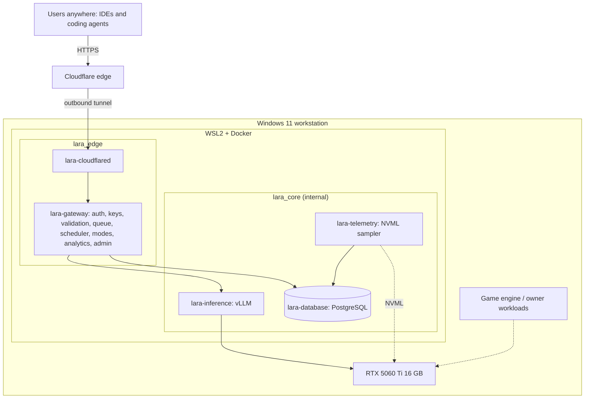

## Implementation Tasks

### 1. Telemetry

1. `lara-telemetry` samples at `LARA_GPU_SAMPLE_INTERVAL_S` and writes to `gpu_samples`: GPU utilization, VRAM used and total, temperature, and power where available (PRD 12.3).
2. It also records host CPU and RAM utilization. **ENGINEERING RECOMMENDATION:** read these from inside WSL2 and record explicitly that they reflect the WSL2 view, which is not identical to the Windows view. Recording the caveat is more useful than pretending precision.
3. Retention: raw samples for a configured window, then hourly aggregates. Raw high-frequency samples are the fastest-growing table in the system.
4. The sampler must never crash the stack. If NVML is unavailable, it logs, marks telemetry unhealthy, and keeps retrying, which also drives the fail-safe pressure behaviour from Session 5.

### 2. Operational metrics

Surface, from the gateway:

| Metric | Source |
| --- | --- |
| GPU utilization, VRAM, temperature, power | `gpu_samples` |
| CPU and RAM | `gpu_samples` companion columns |
| Active jobs, queue depth | scheduler, live |
| Effective ceiling and current mode | policy engine |
| Current pressure level | pressure evaluator |
| TTFT and tokens per second, recent distribution | `jobs` |
| Error counts by class | `jobs` |
| Backend health, model alias in service | registry reconciliation |

`GET /admin/metrics` returns these as JSON. **ENGINEERING RECOMMENDATION:** a single self-hosted HTML dashboard page served by the gateway is sufficient at this scale. Prometheus and Grafana remain a legitimate later option and are free to self-host, but they are two more services and a second data store for one node.

### 3. Usage analytics

Rollups into `usage_daily` per user, per day, per model (section 21.8): requests, completed, failed, cancelled, rejected, input and output tokens where available, total generation time, mean and p95 queue wait, mean and p95 TTFT, and active agent sessions.

**ENGINEERING RECOMMENDATION.** Roll up on a schedule rather than querying raw `jobs` for every dashboard load. It keeps the leaderboard cheap and lets `jobs` retention be shorter than analytics retention.

Include the starvation check from section 5.4: p95 queue wait broken down by role. If low-priority p95 grows without bound across a week of real use, implement aging. That is the measurement the PRD asks for before adding scheduler complexity.

### 4. Leaderboard

**PRD REQUIREMENT** (PRD 13.3, 13.4, Appendix D rule 9): do not rank by raw token generation, and do not reward spam.

**ENGINEERING RECOMMENDATION** for a scoring model that resists gaming:

| Component | Rationale | Anti-gaming property |
| --- | --- | --- |
| Successful requests | Rewards use that completes | Failed and cancelled requests score nothing |
| Distinct active days | Rewards sustained real work | Cannot be farmed in one burst |
| Agent sessions completed | Approximates real tasks rather than raw calls | A session is many requests, so spamming requests does not multiply it |
| Diminishing returns per day | Caps burst farming | Score contribution per day saturates |
| Token volume | Included with a small weight, if at all | Never the primary term |

Scoring weights are configuration so the model can be retuned without a deployment.

Privacy (PRD 13.5): the leaderboard shows a display name and score. Never keys, prompts, source code, responses, or authentication data.

### 5. Logging and storage budget

**PRD REQUIREMENT** (PRD 12.1, 12.5): approximately 20 GB operational budget, automatic rotation, and the service must never fill the disk.

| Stream | Control | Retention |
| --- | --- | --- |
| Container logs (all services) | Docker `json-file` with `max-size` and `max-file` per service | Bounded by the driver |
| Gateway application logs | Structured JSON, bounded by the same driver | Bounded |
| `jobs` rows | Scheduled deletion job | Configurable, e.g. 90 days |
| `gpu_samples` raw | Scheduled aggregation and deletion | Configurable, e.g. 14 days raw |
| `gpu_samples_hourly` | Aggregates | Longer, e.g. 1 year |
| `audit_events` | Scheduled deletion | Longest, e.g. 1 year |
| `usage_daily` | Aggregates | Retained |

Compute the worst-case total against the 20 GB budget and record the arithmetic in `docs/operations/storage-budget.md`. Verify with a real measurement after a week of operation. **PRD REQUIREMENT** 12.4: transcript logging stays off by default; if it is ever enabled it is explicitly configured, access-controlled, retention-limited, and documented.

### 6. Production benchmarks

**MUST BE BENCHMARKED ON PRODUCTION HARDWARE.** Run the Session 2 harness properly, per candidate model:

| Scenario | Measure |
| --- | --- |
| 1 concurrent job | TTFT, tokens per second, wall-clock, VRAM, GPU utilization, CPU, RAM |
| 2 concurrent jobs | Same, plus per-request degradation versus the 1-job case |
| 3 concurrent jobs | Same, plus VRAM headroom remaining |
| 3 concurrent at long context | Same, plus whether KV cache limits are reached |
| Sustained load | Stability, thermal behaviour, throttling, memory growth |
| Game Dev Mode with a real Unity or Unreal workload | Pressure levels observed, AI behaviour, whether the game workload stayed usable |

Every result records: model config file, quantization, context settings, mode, host state, date, and runtime image tag. Results without configuration are not results.

The 3-job ceiling itself is validated here. If measurement shows 3 concurrent jobs at the working context length exhausts VRAM or degrades unacceptably, that is a finding to record and escalate as a PRD revision, not something to silently change.

### 7. Agentic coding benchmark

**PRD REQUIREMENT** (PRD 17.3, master task 40). Simple chat prompts are not the primary benchmark.

Define at least one repeatable task with a fixed starting repository, for example: implement a small REST endpoint, write tests, run them, observe failures, fix, rerun until green. Fix the agent, the agent version, the prompt, and the starting commit so results are comparable across models.

| Metric | Definition |
| --- | --- |
| Task completion | Did the agent reach a passing test suite without human intervention |
| Test pass rate | Fraction of the target suite passing at the end |
| Agent turns | Number of model round trips |
| Failed tool calls | Malformed or rejected tool invocations, the most common small-model failure |
| Total tokens | Input and output |
| Wall-clock | Including queue wait |
| Repeatability | At least three runs; report the spread, not just the best run |

**Engineering Note.** Failed tool calls are the metric that most often separates a model that benchmarks well from a model that is actually usable by a coding agent. Weight it heavily in the selection decision.

### 8. Production model selection

Select the production model from measured evidence: agentic task completion first, tool-call reliability second, then tokens per second, VRAM headroom, and behaviour under 3 concurrent jobs. Record the decision, the runner-up, and why, in `docs/benchmarks/model-selection.md`. Set the registry default and the active config. Until this file exists with real numbers, LARA has no production model.

### 9. Failure recovery testing

Kill each component and verify behaviour (PRD 15.5): gateway, inference, database, telemetry, cloudflared, Docker itself, and a full host reboot. For each, record what clients see, whether recovery is automatic, how long it takes, and whether any job is left in a bad state. Write `docs/operations/recovery.md` from the results.

### 10. V1 freeze

1. Execute the full V1 definition-of-done checklist (section 26).
2. Re-run the Session 6 exposure audit.
3. Verify a clean-machine deployment: clone, copy `.env.example` to `.env`, fill values, `docker compose up -d`, health checks pass. Anything that requires an undocumented manual step is a defect, not a note.
4. Tag the release and record the exact versions in service: gateway image, vLLM image tag, PostgreSQL version, cloudflared version, model, and model config.

## Repository Changes

```text
monitoring/
├── Dockerfile
└── collector/                  (NVML and system sampler)

gateway/app/analytics/          (rollups, leaderboard, metrics API)
gateway/app/api/lara/           (/lara/leaderboard, /lara/me)
gateway/app/api/admin/          (/admin/metrics, /admin/analytics)
database/migrations/            (gpu_samples, gpu_samples_hourly, usage_daily)
tests/production/               (GPU-only suite)
docs/benchmarks/                (v1-concurrency.md, v1-agentic.md, model-selection.md)
docs/operations/recovery.md, storage-budget.md
```

## Interfaces

| Method | Path | Auth | Purpose |
| --- | --- | --- | --- |
| `GET` | `/lara/leaderboard` | API key | Display names and scores only |
| `GET` | `/lara/me` | API key | Caller's own usage summary |
| `GET` | `/admin/metrics` | admin | Live operational metrics |
| `GET` | `/admin/analytics` | admin | Usage rollups, filterable |
| `GET` | `/admin/audit` | admin | Audit events, filterable |
| `GET` | `/status` | API key | Now includes telemetry health and pressure level |

## Data Flow

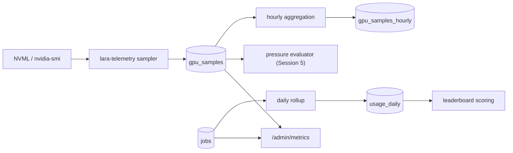

## Configuration

| Key | Purpose |
| --- | --- |
| `LARA_GPU_SAMPLE_INTERVAL_S` | Sampling period |
| `LARA_RETENTION_JOBS_DAYS` | Job record retention |
| `LARA_RETENTION_GPU_RAW_DAYS` | Raw sample retention |
| `LARA_RETENTION_AUDIT_DAYS` | Audit retention |
| `LARA_LOG_MAX_GB` | Total operational storage budget, default aligned to the PRD's 20 GB |
| `LARA_LEADERBOARD_ENABLED` | Feature switch |
| `LARA_LEADERBOARD_WEIGHTS` | Scoring weights, tunable without deployment |
| `LARA_TRANSCRIPT_LOGGING` | **Remains false.** Enabling it is a deliberate, documented, time-boxed exception |

## Security Considerations

1. Analytics and the leaderboard expose no content, no keys, and no authentication data.
2. `/admin/metrics` and `/admin/analytics` are administrative, never public.
3. Aggregates can still leak: a per-user, per-hour breakdown visible to all users would reveal work patterns. Keep detailed analytics administrative and give users only their own data through `/lara/me`.
4. Retention jobs are a deletion path. Test them against a copy first; an incorrect retention query is a data-loss event.
5. The freeze re-runs the exposure audit, because six sessions of changes are exactly how an accidental port binding survives.

## Failure Modes

| Failure | Consequence | Handling |
| --- | --- | --- |
| Sampler crashes | No telemetry, pressure unknown | Restart policy, health flag, fail-safe pressure treatment |
| Sample table grows without bound | Disk pressure | Retention plus aggregation; verified against the budget |
| Rollup job fails silently | Stale leaderboard and analytics | Record last successful rollup, surface it in `/admin/metrics` |
| Benchmarks run with other load present | Meaningless numbers | Record host state with every result; rerun if contaminated |
| Benchmark comparison across different configs | Wrong model selected | Configuration recorded with every result; never compare across unequal settings |
| Leaderboard gamed | Community trust lost | Scoring model in section 7 step 4, weights tunable |
| Retention deletes too much | Lost history | Test on a copy, keep aggregates longer than raw |
| Recovery test skipped | Unknown behaviour during a real outage | It is a gate item, not optional |

## Testing

The full V1 test matrix is section 24. Session-specific tests:

| ID | Test | Pass criterion |
| --- | --- | --- |
| T-S7-01 | Telemetry sampling | Samples land at the configured interval with plausible values |
| T-S7-02 | Telemetry outage | Sampler recovers; pressure fails safe; alert logged |
| T-S7-03 | Retention | Old rows removed, aggregates retained, budget respected |
| T-S7-04 | Log rotation | Sustained load does not grow logs without bound |
| T-S7-05 | Storage budget | Measured total after a week is within `LARA_LOG_MAX_GB` |
| T-S7-06 | Analytics accuracy | Rollups reconcile against raw `jobs` for a sample window |
| T-S7-07 | Leaderboard anti-gaming | A spam pattern of trivial requests does not rise up the ranking |
| T-S7-08 | Leaderboard privacy | Response contains display name and score only |
| T-S7-09 | Concurrency benchmarks | 1, 2, and 3 job results recorded with full context |
| T-S7-10 | Agentic benchmark | At least one task completes; metrics recorded across at least three runs |
| T-S7-11 | Game Dev Mode, real workload | Game workload remains usable; AI behaves per policy; thresholds tuned from observation |
| T-S7-12 | Failure recovery | Every killed component recovers per the runbook |
| T-S7-13 | Clean deployment | Clone to running service using only documented steps |
| T-S7-14 | Exposure audit rerun | All negative tests still pass |
| T-S7-15 | Full regression | Sessions 3, 4, 5, 6 suites all pass on the frozen build |

## Acceptance Criteria

- [ ] GPU and system telemetry are collected, retained, and visible.
- [ ] Queue depth, active jobs, TTFT, tokens per second, and error classes are observable.
- [ ] Usage analytics are accurate against raw job records.
- [ ] Leaderboard resists spam and exposes no private data.
- [ ] Logs rotate and total storage stays within budget.
- [ ] Transcript logging is off by default and verified off.
- [ ] 1, 2, and 3 concurrent benchmarks are recorded with configuration and host state.
- [ ] At least one agentic coding benchmark succeeded, with repeat runs.
- [ ] The production model is selected from evidence and recorded.
- [ ] Game Dev Mode is validated against a real game workload and thresholds are tuned.
- [ ] Failure recovery is tested for every component and a host reboot.
- [ ] A clean-machine deployment works from documentation alone.
- [ ] The full V1 checklist in section 26 is complete.

## Exit Gate

**V1 is frozen when:**

1. Every box in section 26 is checked with evidence.
2. Benchmarks exist for 1, 2, and 3 concurrent jobs on the RTX 5060 Ti.
3. At least one agentic coding benchmark completed and is repeatable.
4. The production model decision is recorded with its measurements.
5. Recovery is tested and documented for every component.
6. The exposure audit passes on the frozen build.
7. A clean deployment succeeds from documentation alone.
8. Versions in service are recorded and the release is tagged.

After the freeze, new capability goes into a V2 backlog. The scheduler improvements deferred in Session 4, dashboards beyond the built-in page, and any new infrastructure all require the same standard the PRD applies throughout: a measured requirement first.
---

# PART III — CONSOLIDATED REFERENCE

---

## 20. API Reference

### 20.1 Surfaces

| Surface | Prefix | Audience | Auth |
| --- | --- | --- | --- |
| OpenAI-compatible inference | `/v1` | Coding agents, IDEs, scripts | API key |
| LARA extensions | `/lara` | Same clients, LARA-specific features | API key |
| Health | `/health`, `/status` | Infrastructure and users | none / API key |
| Administration | `/admin` | Owner and administrators | API key with an admin-capable role |

**PRD REQUIREMENT** (PRD Appendix B): administrative endpoints live outside the public OpenAI-compatible surface and require administrative authorization.

Authentication header on every authenticated route:

```text
Authorization: Bearer lara_<key_id>_<secret>
```

### 20.2 Endpoint table

| Method | Path | Auth | Purpose | Principal failures |
| --- | --- | --- | --- | --- |
| `GET` | `/v1/models` | key | List enabled aliases in OpenAI list shape | `401` |
| `POST` | `/v1/chat/completions` | key | Primary inference, streaming and non-streaming | `400`, `401`, `403`, `404` unknown alias, `413`, `429` queue full or rate limited, `502` backend, `503` queue timeout or switching, `504` first-token timeout |
| `POST` | `/v1/responses` | key | Responses-style inference where the backend supports it | As above, plus a clear unsupported error when the backend lacks it |
| `GET` | `/health` | none | Liveness, minimal body | none |
| `GET` | `/status` | key | Backend health, active model alias, mode, pressure level, active and queued counts, telemetry health | `401` |
| `GET` | `/lara/queue` | key | Active count, queue depth, effective ceiling, caller's own waiting jobs | `401` |
| `GET` | `/lara/jobs/{request_id}` | key, owner | Job status, timings, token counts. Never content | `401`, `403`, `404` |
| `POST` | `/lara/jobs/{request_id}/cancel` | key, owner | Cancel own job | `401`, `403`, `404`, `409` already terminal |
| `GET` | `/lara/me` | key | Caller's own usage summary | `401` |
| `GET` | `/lara/leaderboard` | key | Display names and scores | `401`, `404` if disabled |
| `POST` | `/admin/users` | admin | Create a user | `400`, `403`, `409` duplicate |
| `GET` | `/admin/users` | admin | List users | `403` |
| `GET` | `/admin/users/{id}` | admin | Read a user. Never secrets | `403`, `404` |
| `PATCH` | `/admin/users/{id}` | admin | Enable, disable, change role, change display name | `400`, `403`, `404` |
| `POST` | `/admin/users/{id}/api-keys` | admin | Issue a key. **Full key returned once** | `403`, `404` |
| `GET` | `/admin/users/{id}/api-keys` | admin | List key metadata. Never secrets | `403`, `404` |
| `DELETE` | `/admin/api-keys/{key_id}` | admin | Revoke immediately | `403`, `404` |
| `GET` | `/admin/mode` | admin | Current mode, effective policy, pressure level | `403` |
| `POST` | `/admin/mode` | admin | Set mode, audited | `400` unknown mode, `403` |
| `GET` | `/admin/models` | admin | Registry rows including disabled | `403` |
| `POST` | `/admin/models` | admin | Add a registry row | `400`, `403`, `409` |
| `PATCH` | `/admin/models/{alias}` | admin | Enable, disable, set default, repoint | `400`, `403`, `404` |
| `GET` | `/admin/jobs` | admin | All jobs, filterable | `403` |
| `POST` | `/admin/jobs/{request_id}/cancel` | admin | Cancel any job, audited | `403`, `404`, `409` |
| `GET` | `/admin/metrics` | admin | Live operational metrics | `403` |
| `GET` | `/admin/analytics` | admin | Usage rollups | `403` |
| `GET` | `/admin/audit` | admin | Audit events, filterable | `403` |

### 20.3 Request and response conventions

Inference requests follow the OpenAI shape. `model` carries a LARA alias, never a filesystem path or backend id.

```json
{
  "model": "<lara-alias>",
  "messages": [{"role": "user", "content": "..."}],
  "stream": true,
  "max_tokens": 1024
}
```

Rules:

1. `max_tokens` above the effective mode cap is clamped down, and the clamp is reported in `X-LARA-Max-Tokens-Applied`. Clamping is preferable to rejecting, because agents frequently send a large default.
2. Requests whose estimated context exceeds the model's `context_limit` are rejected with `400` before any backend call.
3. Unknown parameters are passed through to the backend only if the backend accepts them. Unknown-parameter behaviour is **UNKNOWN — MUST BE VERIFIED** per backend and must be recorded in `docs/operations/inference-runtime.md`.
4. Response bodies for successful inference are the backend's, unmodified.

Response headers on inference routes:

| Header | Meaning |
| --- | --- |
| `X-LARA-Request-Id` | Job id, used for support, cancellation, and correlation |
| `X-LARA-Queue-Wait-Ms` | Time spent queued |
| `X-LARA-Mode` | Mode in effect when admitted |
| `X-LARA-Model` | Alias served |
| `X-LARA-Max-Tokens-Applied` | Present when clamped |

Error body shape, uniform across LARA-generated errors:

```json
{
  "error": {
    "type": "queue_timeout",
    "message": "Request waited longer than the configured queue timeout.",
    "request_id": "..."
  }
}
```

Errors never contain internal hostnames, container names, file paths, stack traces, or model file locations.

### 20.4 Status-code semantics

| Code | Meaning in LARA |
| --- | --- |
| `400` | Malformed request, or context exceeds the model limit |
| `401` | Authentication failed. Uniform for every cause |
| `403` | Authenticated but not permitted: disabled user, insufficient role, or not the job owner |
| `404` | Unknown or disabled model alias, or unknown job |
| `409` | Job already in a terminal state |
| `413` | Request body exceeds `LARA_MAX_REQUEST_BYTES` |
| `429` | Queue full or per-key rate limit exceeded |
| `502` | Backend unreachable or returned an error |
| `503` | Queue timeout, model switch in progress, or service intentionally paused |
| `504` | No first token within the timeout |

---

## 21. Database Reference

PostgreSQL runs locally in `lara-database` on the private network. **PRD REQUIREMENT:** no hosted database, ever (master task 14, 19).

### 21.1 Entity overview

| Entity | Purpose | Growth | Retention |
| --- | --- | --- | --- |
| `users` | Identity, role, enablement, display name | Bounded at 50 | Life of the service |
| `roles` | Configurable role names and priority weights | Tiny | Life of the service |
| `api_keys` | Per-user credentials, hashed | Small | Retain revoked rows for audit |
| `inference_backends` | Backend runtimes and base URLs | Tiny | Life of the service |
| `models` | Registry: aliases to backend model ids | Small | Life of the service |
| `jobs` | One row per inference request | Largest transactional table | `LARA_RETENTION_JOBS_DAYS` |
| `gpu_samples` | Periodic GPU and system telemetry | Fastest growing | `LARA_RETENTION_GPU_RAW_DAYS`, then aggregated |
| `gpu_samples_hourly` | Aggregates | Slow | Long |
| `operating_mode` | Current mode, single row | Single row | Life of the service |
| `audit_events` | Administrative and security events | Moderate | `LARA_RETENTION_AUDIT_DAYS` |
| `usage_daily` | Analytics and leaderboard rollups | Slow | Long |

No other tables are created. **PRD REQUIREMENT** (master task 14): do not create unnecessary tables.

### 21.2 `users`

| Field | Type | Notes |
| --- | --- | --- |
| `id` | uuid, pk | |
| `username` | text, unique | Login and administrative identity |
| `display_name` | text | The only identity shown on the leaderboard |
| `password_hash` | text, nullable | Argon2id or bcrypt. Null when the user is API-key only |
| `role_id` | fk to `roles` | Drives priority and admin capability |
| `enabled` | boolean | Disabled users are denied even with a valid key |
| `created_at`, `updated_at` | timestamptz | |

Indexes: unique on `username`. Relationships: one user has many `api_keys` and many `jobs`.

### 21.3 `roles`

| Field | Type | Notes |
| --- | --- | --- |
| `id` | smallint, pk | |
| `name` | text, unique | Seed: `owner`, `admin`, `developer`, `researcher`, `member`. Names are seed data, not constants in code |
| `priority` | integer | Higher runs first. Configurable |
| `is_admin` | boolean | Grants the `/admin` surface |
| `description` | text | |

**PRD REQUIREMENT** (PRD 9.4): exact role names and weights are configuration.

### 21.4 `api_keys`

| Field | Type | Notes |
| --- | --- | --- |
| `key_id` | text, pk | Plaintext lookup prefix, indexed |
| `user_id` | fk to `users` | |
| `secret_hash` | text | HMAC-SHA256 with the server pepper. The raw secret is never stored |
| `label` | text | Human-meaningful, for example the machine the key is used from |
| `created_at` | timestamptz | |
| `last_used_at` | timestamptz, nullable | Updated at coarse granularity |
| `revoked_at` | timestamptz, nullable | Non-null means the key is dead immediately |

Indexes: pk on `key_id`, index on `user_id`, partial index where `revoked_at is null`. Retention: revoked rows are kept so historical jobs remain attributable.

### 21.5 `inference_backends` and `models`

`inference_backends`

| Field | Type | Notes |
| --- | --- | --- |
| `id` | smallint, pk | |
| `name` | text, unique | `vllm-prod`, `ollama-dev` |
| `runtime` | text | `vllm` or `ollama`. Selects the adapter |
| `base_url` | text | Internal URL. Never exposed publicly |
| `enabled` | boolean | |

`models`

| Field | Type | Notes |
| --- | --- | --- |
| `id` | uuid, pk | |
| `alias` | text, unique | The only model identifier a client ever sees |
| `backend_id` | fk to `inference_backends` | |
| `model_ref` | text | Real model id or path as the backend expects it |
| `quantization` | text, nullable | Recorded from the candidate's real format |
| `context_limit` | integer | Validation bound for incoming requests |
| `max_output_default` | integer, nullable | Default output cap when the client sends none |
| `config_file` | text, nullable | The `inference/configs/` file that starts this model |
| `enabled` | boolean | Only enabled aliases appear in `/v1/models` |
| `is_default` | boolean | Used when the client omits `model`. Exactly one true |
| `notes` | text | Compatibility findings and benchmark pointers |

Indexes: unique on `alias`, unique partial on `is_default` where true.

### 21.6 `jobs`

| Field | Type | Notes |
| --- | --- | --- |
| `request_id` | uuid, pk | Returned to the client in headers |
| `user_id` | fk to `users` | |
| `key_id` | fk to `api_keys` | Which credential was used |
| `model_alias` | text | Denormalized so history survives registry edits |
| `backend_name` | text | Denormalized for the same reason |
| `mode` | text | Mode at submission |
| `effective_priority` | integer | Computed once at enqueue (section 5.4) |
| `status` | text | `RECEIVED`, `QUEUED`, `RUNNING`, `COMPLETED`, `CANCELLED`, `FAILED`, `REJECTED` |
| `stream` | boolean | Whether the client requested streaming |
| `received_at`, `queued_at`, `started_at`, `completed_at` | timestamptz | |
| `queue_wait_ms`, `generation_ms`, `ttft_ms` | integer, nullable | Stored, not recomputed |
| `input_tokens`, `output_tokens` | integer, nullable | Where the backend reports them |
| `error_class` | text, nullable | From the matrix in section 5.2.2 |
| `client_ip_hash` | text, nullable | **ENGINEERING RECOMMENDATION:** store a salted hash, not the raw address. Enough for abuse correlation, not a location record |

Indexes: pk on `request_id`; `(user_id, received_at desc)`; partial index on `status` where status in (`QUEUED`,`RUNNING`) for the reconciliation and live-count queries; `(received_at)` for retention deletion; `(model_alias, received_at)` for analytics.

**PRD REQUIREMENT** (PRD 12.4): no prompt, message, or response content in this table. Ever.

### 21.7 `gpu_samples`, `gpu_samples_hourly`, `operating_mode`, `audit_events`

`gpu_samples`

| Field | Type | Notes |
| --- | --- | --- |
| `sampled_at` | timestamptz, pk part | |
| `gpu_util_pct`, `vram_used_mib`, `vram_total_mib`, `temp_c` | numeric | |
| `power_w` | numeric, nullable | Only if reported |
| `cpu_pct`, `ram_used_mib` | numeric | Recorded as the WSL2 view, documented as such |
| `active_jobs`, `queue_depth` | integer | Correlates GPU state with LARA load |

Index on `sampled_at desc`. This is the fastest-growing table; retention and aggregation are not optional.

`gpu_samples_hourly`: hour bucket plus min, mean, max, and p95 of the same measures.

`operating_mode`: single row with `mode`, `changed_at`, `changed_by`, plus a `switching` flag used during model switches. History lives in `audit_events`.

`audit_events`

| Field | Type | Notes |
| --- | --- | --- |
| `id` | bigserial, pk | |
| `occurred_at` | timestamptz | |
| `actor_user_id` | fk, nullable | Null for system events |
| `event_type` | text | `user.create`, `user.disable`, `role.change`, `key.issue`, `key.revoke`, `mode.change`, `model.enable`, `model.switch`, `job.admin_cancel`, `auth.fail`, `rate.limit` |
| `target` | text | Affected entity id or alias |
| `detail` | jsonb | Structured context. **Never** a key, secret, prompt, or response |
| `source_ip_hash` | text, nullable | Salted hash |

Indexes: `(occurred_at desc)`, `(event_type, occurred_at desc)`.

### 21.8 `usage_daily`

| Field | Type | Notes |
| --- | --- | --- |
| `day` | date, pk part | |
| `user_id` | fk, pk part | |
| `model_alias` | text, pk part | |
| `requests`, `completed`, `failed`, `cancelled`, `rejected` | integer | |
| `input_tokens`, `output_tokens` | bigint | Where available |
| `generation_ms_total` | bigint | |
| `queue_wait_ms_mean`, `queue_wait_ms_p95` | integer | Feeds the starvation check in section 5.4 |
| `ttft_ms_mean`, `ttft_ms_p95` | integer | |
| `agent_sessions` | integer | **ENGINEERING RECOMMENDATION:** approximate a session as a run of requests from one key with gaps below a configured idle threshold. Record the definition next to the number |

Retention: kept after `jobs` rows are deleted, which is the point of the rollup.

### 21.9 Migration and seed policy

1. Every schema change is an Alembic migration. No manual schema edits on the running system.
2. Migrations run before the gateway serves traffic; a mismatch fails the healthcheck rather than serving on an unknown schema.
3. Seed data covers roles, the owner account, backend rows, and initial model rows. Seeds are idempotent.
4. The owner's first API key is issued through the admin path and displayed once. It is never a fixed value in seed data.
5. `pg_dump` of the database, plus `.env`, plus the model directory, is the complete backup set. Everything else is rebuildable from Git.
---

## 22. Model Configuration, Compatibility, and Switching

### 22.1 The plug-and-play requirement

> Build the platform once. Change the model through configuration and deployment, not application rewrites.

Changing a model must not require rewriting authentication, users, API keys, the queue, the scheduler, the priority system, operating modes, analytics, the database, client integrations, or the public API contract. The acceptance test is T-S5-18.

**Model agnosticity, stated honestly** (master task 8). LARA does not claim every model works. The correct claim is: LARA supports any model compatible with the selected inference runtime, model architecture, format, quantization, context requirements, and available GPU memory. What LARA guarantees is that testing compatibility is straightforward and that the answer is recorded.

### 22.2 Compatibility validation

Run before downloading, then confirm after loading. Record every answer in `docs/benchmarks/model-candidates.md`.

| Dimension | Question | How to verify | Failure symptom |
| --- | --- | --- | --- |
| Architecture | Is the model family supported by the pinned runtime version? | Runtime's supported-model documentation for that exact version | Container exits with an unsupported-architecture error |
| Format | Safetensors, GGUF, or other? | Model repository file listing | Runtime refuses to load, or loads through an unintended path |
| GGUF specifically | Does the pinned vLLM version support it, and on this GPU? | **UNKNOWN — MUST BE VERIFIED.** Do not assume parity with other runtimes | Load failure or severe performance anomaly |
| Quantization | Is this quantization implemented for this GPU architecture in this version? | Runtime documentation plus an actual load attempt | Kernel-not-found or unsupported-quantization error |
| VRAM feasibility | Weights plus KV cache plus overhead within the reservation? | Estimate first, then measure with `vram-probe.sh` | Out of memory at load or during generation |
| Context | Does the model's usable context meet the agentic workload's needs at the concurrency target? | Load with the target maximum sequence length and run a long-context test | Out of memory, or truncation |
| Tokenizer and chat template | Does the model ship a chat template, and does it support tool calling? | Inspect the tokenizer configuration; run a template render | Malformed prompts, agents behaving strangely |
| Tool calling | Does the runtime plus model combination produce well-formed tool calls? | Tool-call smoke test through a real agent | Agent loops, failed tool calls, task never completes |
| Streaming | Do chunks arrive incrementally with correct termination? | `curl --no-buffer` plus an agent test | Buffered output, hanging clients |
| `/v1/responses` | Supported by this runtime version for this model? | **UNKNOWN — MUST BE VERIFIED** | `404` or a shape mismatch |
| Stability | Sustained load without leaks or degradation? | Soak test | Slow degradation, restarts |
| License | Does the license permit this use? | Model card | Legal exposure, not a technical failure |

**Engineering Note.** Tool calling and the chat template are the two dimensions most often skipped and most often fatal. A model that chats well but emits malformed tool calls is useless for the PRD's primary workload (PRD 1.1, 6.3).

### 22.3 Model configuration file

One file per profile in `inference/configs/`. It is the source of truth for how the runtime starts.

**ENGINEERING RECOMMENDATION**, shape only. Every field must map to a real argument of the pinned runtime version; fields the runtime does not accept must not be invented (master task 9).

```yaml
# inference/configs/<profile-name>.yaml
alias: <lara-alias>                 # registry alias this profile serves
backend: vllm-prod

model_ref: <path or repository id>  # as the runtime expects it
served_model_name: <id the backend advertises on /v1/models>
quantization: <format or null>      # only if the runtime accepts this argument
dtype: <value or null>              # only where applicable
max_model_len: <integer>            # UNKNOWN until measured on this GPU
gpu_memory_utilization: <fraction>  # UNKNOWN until measured on this GPU
extra_args: []                      # runtime-specific flags, e.g. tool-call parser options

# recorded facts, not runtime arguments
verified_on_image: <pinned image tag>
verified_at: <date>
notes: <compatibility findings>
```

Rules:

1. `max_model_len` and `gpu_memory_utilization` are **MUST BE BENCHMARKED ON PRODUCTION HARDWARE**. Provisional values may be committed only when marked as such.
2. A `gamedev` variant profile of the production model is expected: same weights, lower memory fraction, shorter maximum sequence length, for extended game-development sessions (section 5.3.3).
3. No model-specific value may appear in application code (**PRD REQUIREMENT**, master task 35).

### 22.4 Switch runbook

Diagram 10 in Session 5 is the flow. The operational checklist:

| Step | Action | Verify | On failure |
| --- | --- | --- | --- |
| 1 | Select candidate | Compatibility table 22.2 complete on paper | Reject the candidate |
| 2 | Estimate memory feasibility | Estimate recorded | Reject or reduce context target |
| 3 | Download into `LARA_MODEL_DIR` | Checksum and size recorded, weights outside Git | Retry, verify storage headroom |
| 4 | Write the config file | Committed to Git | n/a |
| 5 | Announce and drain | Admission stops, running jobs finish within `LARA_DRAIN_TIMEOUT_S` | Fail remaining jobs explicitly with `drain_timeout` |
| 6 | Recreate `lara-inference` | Container healthy | Roll back to the previous config, verify service restored |
| 7 | Runtime health check | Backend healthy | Roll back |
| 8 | Backend `/v1/models` | Serves the expected id | Roll back |
| 9 | Generation smoke test | Non-streaming and streaming both succeed | Roll back |
| 10 | Tool-call smoke test | Well-formed tool calls | Roll back if the workload needs tools |
| 11 | Benchmark | Results recorded with configuration and host state | Record and decide |
| 12 | Update the registry | Alias enabled, default set, reconciliation clean | Fix the row, re-verify |
| 13 | Resume admission | `/status` no longer reports `switching` | n/a |
| 14 | Record downtime | Written into `docs/operations/model-switch.md` | n/a |

If a candidate genuinely requires an application code change, document exactly what and why (master task 36). That is a finding about the model, not a licence to spread model-specific logic through the gateway.

---

## 23. Configuration Reference

### 23.1 Where each value belongs

| Location | Holds | Never holds |
| --- | --- | --- |
| `.env` (git-ignored) | Real secrets and host-specific values: database credentials, key pepper, tunnel token, model directory path | Anything committed |
| `.env.example` (committed) | Every key with a placeholder and a comment | Any real secret |
| `compose.yaml` (committed) | Service topology, networks, volumes, image tags, healthchecks, log caps | Secrets, model-specific arguments |
| `inference/configs/*.yaml` (committed) | Everything model-specific | Secrets |
| Database (`roles`, `models`, `inference_backends`, `operating_mode`) | Runtime-changeable operational state | Secrets |
| Gateway settings module | Reading and validating the above | Hard-coded secrets, hard-coded model assumptions |

**PRD REQUIREMENT** (PRD 11.4, 16.4): secrets are injected through the environment, never committed, never printed in logs, never returned by diagnostic endpoints.

### 23.2 Configuration table

| Key | Domain | Default | Session |
| --- | --- | --- | --- |
| `LARA_ENV` | `dev` or `prod` | `dev` | 1 |
| `LARA_LOG_LEVEL` | log verbosity | `info` | 1 |
| `LARA_MODEL_DIR` | host path | none | 1 |
| `COMPOSE_PROFILES` | active service profiles | `dev` | 1 |
| `LARA_INFERENCE_IMAGE` | pinned vLLM tag | none | 2 |
| `LARA_ACTIVE_MODEL_CONFIG` | config filename | none | 2 |
| `LARA_VLLM_BASE_URL` | internal URL | `http://lara-inference:8000` | 2 |
| `LARA_OLLAMA_BASE_URL` | dev backend URL | verified form | 2 |
| `DATABASE_URL` | secret | none | 3 |
| `POSTGRES_USER` / `POSTGRES_PASSWORD` / `POSTGRES_DB` | secret | none | 3 |
| `LARA_API_KEY_PEPPER` | secret | none | 3 |
| `LARA_JWT_SECRET` | secret, only if a portal exists | none | 3 |
| `LARA_DEFAULT_BACKEND` | backend name | `ollama-dev` in dev, `vllm-prod` in prod | 3 |
| `LARA_DEFAULT_MODEL_ALIAS` | alias | none | 3 |
| `LARA_MAX_REQUEST_BYTES` | request cap | configurable | 3 |
| `LARA_CONNECT_TIMEOUT_S` | upstream connect | configurable | 3 |
| `LARA_TTFT_TIMEOUT_S` | first token | NOT YET MEASURED | 3 |
| `LARA_REQUEST_TIMEOUT_S` | total generation | NOT YET MEASURED | 3 |
| `LARA_MAX_ACTIVE_JOBS` | **3** | **PRD REQUIREMENT** | 4 |
| `LARA_PER_USER_MAX_ACTIVE` | per-user cap | `1` | 4 |
| `LARA_QUEUE_MAX_DEPTH` | backpressure | NOT YET MEASURED | 4 |
| `LARA_QUEUE_TIMEOUT_S` | maximum wait | NOT YET MEASURED | 4 |
| `LARA_SSE_KEEPALIVE_S` | queue keepalive | configurable | 4 |
| `LARA_MODE_DEFAULT` | `SERVING` | | 5 |
| `LARA_GPU_SAMPLE_INTERVAL_S` | sampling period | configurable | 5 |
| `LARA_PRESSURE_WINDOW_SAMPLES` | rolling window | configurable | 5 |
| `LARA_PRESSURE_HYSTERESIS_SAMPLES` | level stability | configurable | 5 |
| `LARA_PRESSURE_VRAM_*` / `LARA_PRESSURE_UTIL_*` / `LARA_PRESSURE_TEMP_CRITICAL` | thresholds | **NOT YET MEASURED** | 5 |
| `LARA_DRAIN_TIMEOUT_S` | switch drain | configurable | 5 |
| `CLOUDFLARE_TUNNEL_TOKEN` | secret | none | 6 |
| `LARA_PUBLIC_BASE_URL` | documentation | none | 6 |
| `LARA_RATE_LIMIT_REQUESTS` / `LARA_RATE_LIMIT_WINDOW_S` | per-key arrival rate | NOT YET MEASURED | 6 |
| `LARA_AUTH_FAIL_THRESHOLD` / `_WINDOW_S` / `_BLOCK_S` | credential-guess protection | configurable | 6 |
| `LARA_TRUSTED_PROXY_HEADERS` | client IP source | tunnel only | 6 |
| `LARA_RETENTION_JOBS_DAYS` | retention | e.g. 90 | 7 |
| `LARA_RETENTION_GPU_RAW_DAYS` | retention | e.g. 14 | 7 |
| `LARA_RETENTION_AUDIT_DAYS` | retention | e.g. 365 | 7 |
| `LARA_LOG_MAX_GB` | storage budget | `20` (**PRD REQUIREMENT** 12.1) | 7 |
| `LARA_LEADERBOARD_ENABLED` / `LARA_LEADERBOARD_WEIGHTS` | scoring | configurable | 7 |
| `LARA_TRANSCRIPT_LOGGING` | prompt capture | **`false`** (**PRD REQUIREMENT** 12.4) | 3 |

Every value marked `NOT YET MEASURED` ships as a provisional default with a comment in `.env.example` saying so, and is set properly in Session 7.

### 23.3 Logging and the storage budget

| Layer | Mechanism | Bound |
| --- | --- | --- |
| Container stdout and stderr | Docker `json-file` with `max-size` and `max-file` per service | Hard cap per service, computed against 20 GB total |
| Gateway application logs | Structured JSON to stdout, no separate files | Same cap |
| Database tables | Retention jobs per section 21 | Configured windows |
| Model weights | Not logs, but on the same volume | Sized when a model is chosen |

Rules:

1. Compute the worst case as: sum of per-service log caps, plus estimated table growth at the retention windows, plus headroom. Record the arithmetic in `docs/operations/storage-budget.md`.
2. Verify against reality after a week of operation, and adjust.
3. **PRD REQUIREMENT** (PRD 12.5): the service must never fill the disk because logging was forgotten.
4. Raw API keys, prompts, responses, and secrets never appear in any log at any level. Log `key_id`, `request_id`, `user_id`, and token counts.
5. If transcript logging is ever switched on, it is time-boxed, access-controlled, retention-limited, announced to affected users, and switched off again. Record every activation in `audit_events`.
---

## 24. Testing Specification

### 24.1 Two suites, one hard rule

**PRD REQUIREMENT** (PRD 15.1, master task 39). Application-layer testing may run against the Ollama development backend. Production hardware testing must run on the RTX 5060 Ti. The Ollama machine never validates production GPU performance, and no benchmark taken there may be quoted as a LARA result.

| Concern | `tests/unit`, `tests/integration`, `tests/load` (dev backend acceptable) | `tests/production` (RTX 5060 Ti only) |
| --- | --- | --- |
| API shape and contract | Yes | Regression only |
| Authentication, keys, authorization | Yes | Regression only |
| Queue, scheduler, priority, cancellation | Yes | Regression, plus real timing |
| Operating-mode admission logic | Yes, with synthetic pressure | Yes, with real pressure |
| Model registry and alias resolution | Yes | Yes |
| Streaming behaviour | Yes | Yes, including through the tunnel |
| Database, migrations, retention | Yes | Regression only |
| Tunnel and external access | Yes, from the deployment host | Yes |
| vLLM behaviour, VRAM, TTFT, tokens per second | **No** | **Yes, exclusively** |
| Concurrency performance at 1, 2, 3 jobs | **No** | **Yes, exclusively** |
| Thermal and sustained-load behaviour | **No** | **Yes, exclusively** |
| Game Dev Mode against a real game workload | **No** | **Yes, exclusively** |
| Agentic coding benchmark for model selection | Wiring only | **Yes, exclusively** |

### 24.2 V1 test matrix

| Area | Tests | Where |
| --- | --- | --- |
| Infrastructure | T-S1-01 to T-S1-09: GPU chain through Windows, WSL2, Docker, CUDA, Compose; reboot survival; baseline recorded | prod |
| Inference | T-S2-01 to T-S2-12: model load, endpoints, streaming, tool calling, long context, VRAM, restart, exposure | prod, dev for wiring |
| Gateway and auth | T-S3-01 to T-S3-20: allow, deny, revoke, disable, hashing, no keys in logs, alias resolution, streaming, exposure, migrations | dev acceptable |
| Scheduler | T-S4-01 to T-S4-18: 3 running and 7 queued, promotion, priority, FIFO, per-user cap, cancellation, disconnect, timeouts, slot-leak soak, reconciliation | dev acceptable |
| Modes and models | T-S5-01 to T-S5-18: three modes, pressure levels, hysteresis, telemetry loss, audit, alias resolution, switch, rollback, no-code-change proof | dev for logic, prod for real pressure |
| Network and hardening | T-S6-01 to T-S6-18: external access from three networks, streaming through the tunnel, negative exposure tests, abuse controls, reconnection, secret hygiene | prod |
| Observability and freeze | T-S7-01 to T-S7-15: telemetry, retention, storage budget, analytics accuracy, leaderboard anti-gaming and privacy, benchmarks, agentic benchmark, recovery, clean deployment, full regression | prod |

### 24.3 The five acceptance scenarios that define the service

Everything above supports these five. If any fails, V1 is not done.

| Scenario | Expected |
| --- | --- |
| **Concurrency** | 4 simultaneous requests: 3 `RUNNING`, 1 `QUEUED`; the queued one runs when a slot frees |
| **Authentication** | valid allowed; invalid, revoked, disabled, unknown all denied |
| **Modes** | Serving, Personal, and Game Dev each tested independently and behaving per policy |
| **Network** | external laptop to HTTPS to Cloudflare to tunnel to gateway to vLLM, with streaming intact |
| **Recovery** | gateway, vLLM, database, and cloudflared each killed and each recovering per the runbook |

### 24.4 Agentic benchmark specification

**PRD REQUIREMENT** (PRD 17.3, master task 40): the primary benchmark is agentic software development, not chat.

Fixed elements per run: starting repository and commit, task statement, agent and agent version, client configuration, model alias and config file, mode, and host state.

Sequence: implement a feature, inspect the repository, modify files, run tests, observe failures, fix, rerun tests, finish.

| Metric | Recorded |
| --- | --- |
| Task completion | Yes or no, with the failure point if no |
| Test pass rate at the end | Fraction |
| Agent turns | Count |
| Failed tool calls | Count and cause classification |
| Total input and output tokens | Counts |
| Wall-clock including queue wait | Duration |
| Runs | At least three, with the spread reported |

All results land in `docs/benchmarks/v1-agentic.md`. Nothing in this blueprint predicts what those results will be.

---

## 25. Zero-Cost Audit and Cost Table

### 25.1 Audit method

**PRD-aligned requirement** (master task 19, 41). Every required dependency is audited against six questions: is it required; is it self-hosted; does it require payment; does it send data externally; does it have a free self-hosted alternative; is the external service actually necessary.

| Dependency | Required | Self-hosted | Payment | Sends data out | Verdict |
| --- | --- | --- | --- | --- | --- |
| Windows 11 | Yes | Local, already owned | None additional | No | Keep |
| WSL2 | Yes | Local | None | No | Keep |
| Docker and Compose | Yes | Local | None under applicable free use. Licensing terms for the chosen distribution are **UNKNOWN — MUST BE VERIFIED** for this deployment context | No | Keep, verify terms |
| NVIDIA driver and Container Toolkit | Yes | Local | None | No | Keep |
| vLLM | Yes | Local, in Docker | None | No | Keep |
| PostgreSQL | Yes | Local, in Docker | None | No | Keep |
| FastAPI and Python libraries | Yes | Local | None | No | Keep |
| Model weights | Yes | Local | None for software. **License-dependent per model** | Download only | Keep, check each license |
| Telemetry sampler | Yes | Local | None | No | Keep |
| Cloudflare Tunnel | V2 only | Client local, edge external | Free functionality only. Exact free-tier capability **UNKNOWN — MUST BE VERIFIED** | Yes: request traffic transits the edge | Keep for V2, networking only |
| Custom domain | No | External | Optional purchase | n/a | Optional, never required |
| Ollama | Dev only | Local | None | No | Keep as development accelerator only |
| Cloud inference, hosted database, hosted auth, paid monitoring, paid queue | No | n/a | n/a | n/a | **Excluded** |

Two honest notes rather than a clean claim:

1. **Cloudflare Tunnel means traffic transits a third party.** That is a privacy consideration, not a cost one, and it is the trade the PRD accepts to avoid inbound routing (PRD 5.2). Users should be told their requests transit an external edge. Model execution and all data at rest stay on the workstation.
2. **Model licenses are not software cost, but they are still terms.** Check each candidate's license for the intended use before adopting it.

### 25.2 Cost table

| Component | Required | Runs Where | Mandatory Cost |
| --- | --- | --- | ---: |
| WSL2 | Yes | Local | ₹0 |
| Docker | Yes | Local | ₹0 under applicable free use |
| vLLM | Yes | Local | ₹0 |
| PostgreSQL | Yes | Local | ₹0 |
| FastAPI | Yes | Local | ₹0 |
| Model weights | Yes | Local | ₹0 software cost, license-dependent |
| Telemetry and analytics | Yes | Local | ₹0 |
| Ollama (development only) | No | Local | ₹0 |
| Cloudflare Tunnel | V2 | Cloudflare edge + local | ₹0 using free functionality |
| Custom domain | No | External | Optional |
| Cloud inference | No | — | ₹0 |
| Hosted database | No | — | ₹0 |
| Paid AI API | No | — | ₹0 |
| Paid monitoring, auth, or queue | No | — | ₹0 |

Electricity, hardware already owned, and university network access are outside this table. No optional purchase is presented as mandatory infrastructure.

---

## 26. Definition of Done — V1

Executable checklist. Every box needs evidence: a test id, a benchmark file, or an audit record.

**Infrastructure**

- [ ] RTX 5060 Ti is visible inside WSL2 and inside Docker.
- [ ] A CUDA workload succeeds in a container.
- [ ] The GPU chain survives a cold reboot.
- [ ] Docker Compose recreates the whole stack from clean.
- [ ] Failure and restart recovery is tested for every service and a host reboot.

**Inference and models**

- [ ] vLLM runs in Docker with a pinned image tag.
- [ ] The selected model loads successfully.
- [ ] Model compatibility findings are documented per candidate.
- [ ] Model configuration is centralized in `inference/configs/`.
- [ ] Model weights are outside Git and mounted read-only.
- [ ] The model can be replaced without rewriting the gateway (T-S5-18).
- [ ] `/v1/models` works and returns aliases.
- [ ] `/v1/chat/completions` works, streaming and non-streaming.
- [ ] `/v1/responses` works where supported, and its status is recorded where not.
- [ ] Streaming works end to end, including through the tunnel.

**Identity and security**

- [ ] Gateway authentication works.
- [ ] API keys work, are hashed, and are shown only once.
- [ ] Revoked keys fail immediately.
- [ ] Disabled users fail.
- [ ] Admin endpoints are separate and role-protected.
- [ ] vLLM is not publicly exposed.
- [ ] PostgreSQL is not publicly exposed.
- [ ] Docker daemon and WSL management are not exposed.
- [ ] No secret is committed, embedded in an image, or printed in a log.
- [ ] Student repositories are never mounted or stored.

**Scheduling and modes**

- [ ] Three active jobs work.
- [ ] Additional jobs queue and later run.
- [ ] Priority scheduling works, with FIFO inside equal priority.
- [ ] Per-user active cap prevents monopolization.
- [ ] Cancellation works from queued and running, by owner and admin.
- [ ] Client disconnect frees the slot and aborts upstream generation.
- [ ] No slot leak under a soak test.
- [ ] Coding Serving Mode works.
- [ ] Personal Coding Mode works.
- [ ] Game Dev Mode works and is resource-aware, validated against a real game workload.

**Observability and data**

- [ ] GPU and VRAM telemetry works.
- [ ] Queue depth, active jobs, TTFT, tokens per second, and error classes are observable.
- [ ] Logs rotate and total storage stays within the 20 GB budget.
- [ ] Full prompts and responses are not stored by default, verified.
- [ ] Retention jobs run and are tested.
- [ ] Analytics reconcile against raw job records.
- [ ] Leaderboard resists spam and exposes no private data.

**Workload proof**

- [ ] At least one coding agent works end to end.
- [ ] At least one agentic coding benchmark succeeded, with repeat runs.
- [ ] Benchmarks recorded at 1, 2, and 3 concurrent jobs on production hardware.
- [ ] The production model was selected from recorded evidence.

**Cost**

- [ ] No mandatory paid service exists.
- [ ] No cloud inference is required.
- [ ] No custom domain purchase is required for core operation.
- [ ] No hidden billing anywhere in the required stack.

---

## 27. Final Definition of LARA

LARA is a self-hosted, API-first, agentic coding inference platform running on the user's own workstation.

It provides authenticated users with access to local LLM inference through an OpenAI-compatible API. Coding agents remain on user machines. Repositories remain on user machines. The LARA workstation provides inference.

Production inference runs through Dockerized vLLM on the RTX 5060 Ti 16 GB.

The system supports configurable models, three active inference jobs, queueing, priorities, operating modes, authentication, API keys, telemetry, analytics, and secure remote access, without requiring paid inference APIs or mandatory paid cloud infrastructure.

The central engineering objective is not to maximize containers or models. It is to make one 16 GB consumer GPU behave like a reliable small shared inference service while remaining useful as a personal development workstation.

---

## 28. Open Unknowns Register

Every deferred fact in one place. Nothing here may be filled with a guess. Update this table as each is resolved, with the date and the evidence.

| # | Unknown | Blocks | Resolved by | Status |
| --- | --- | --- | --- | --- |
| U-01 | Installed NVIDIA driver and CUDA versions on the workstation | Session 1 | `nvidia-smi`, recorded in `host-setup.md` | Open |
| U-02 | Minimum driver and CUDA versions required for this GPU generation under WSL2 | Session 1, 2 | Current NVIDIA documentation | Open |
| U-03 | Which pinned vLLM image tag has kernels for this GPU architecture | Session 2 | Load test on the real GPU | Open, highest risk |
| U-04 | Which quantization formats are supported on this architecture by that version | Session 2, 5 | Load test per candidate | Open |
| U-05 | Whether the pinned vLLM version implements `/v1/responses` for the chosen model | Session 2, 3 | Direct endpoint test | Open |
| U-06 | Tool-calling support and configuration for the chosen runtime and model | Session 2, 7 | Agent smoke test | Open |
| U-07 | Working Compose GPU-request syntax on this host | Session 1 | Both forms tested | Open |
| U-08 | Container-to-host address form for reaching Ollama under Docker on WSL2 | Session 2, 3 | Connectivity test | Open |
| U-09 | The exact model installed in the developer's Ollama 0.16.3 | Session 2 | `ollama list` | Open |
| U-10 | Ollama's endpoint parity with vLLM, including `/v1/responses` and streaming shape | Session 3 | Endpoint matrix test | Open |
| U-11 | Whether target coding agents tolerate SSE comment keepalives while queued | Session 4 | Per-agent test | Open |
| U-12 | Cloudflare free-tier capability, quick-hostname persistence, and setup flow | Session 6 | Current Cloudflare documentation and a live test | Open |
| U-13 | Docker licensing terms applicable to this deployment context | Session 1, 25 | Current Docker terms | Open |
| U-14 | Safe `max_model_len` and `gpu_memory_utilization` for the chosen model | Session 2, 5, 7 | VRAM probe and load tests | NOT YET MEASURED |
| U-15 | GPU pressure thresholds for MODERATE, HIGH, CRITICAL | Session 5, 7 | Real Unity or Unreal workload | NOT YET MEASURED |
| U-16 | TTFT, tokens per second, and VRAM at 1, 2, and 3 concurrent jobs | Session 7 | Production benchmark | MUST BE BENCHMARKED ON PRODUCTION HARDWARE |
| U-17 | Whether 3 concurrent jobs is safe at the working context length | Session 7 | Production benchmark | MUST BE BENCHMARKED ON PRODUCTION HARDWARE |
| U-18 | Which model becomes the production model | Session 7 | Agentic benchmark | Open |
| U-19 | Timeout and rate-limit values that suit real agent retry behaviour | Session 4, 6, 7 | Observation under real use | NOT YET MEASURED |
| U-20 | Actual storage growth against the 20 GB budget | Session 7 | One week of operation | NOT YET MEASURED |
| U-21 | Model-load time from the chosen storage location, which sets switch downtime | Session 2, 5 | Timed switch | NOT YET MEASURED |
| U-22 | Windows and WSL2 autostart mechanism chosen for unattended boot | Session 6, 7 | Implementation decision, recorded | Open |

---

## 29. Blueprint Self-Audit

**Architecture:** LARA is used consistently; production hardware matches the PRD; vLLM is the production runtime; Ollama is development-only and never a production dependency; the model is configuration-driven; model replacement requires no gateway rewrite; Docker is the packaging mechanism; PostgreSQL, gateway, scheduler, and telemetry are all local.

**Security:** vLLM is never public; PostgreSQL is never public; the Docker daemon and WSL management are never public; student repositories stay client-side; API keys are hashed with a pepper; secrets are never committed; admin endpoints are separated and role-protected; error bodies leak nothing.

**Resource management:** the 3-active-job ceiling is preserved as a PRD requirement; queue behaviour, priority, and fairness are specified; VRAM is treated as the primary resource; Game Dev Mode is resource-aware and its real limits are stated honestly.

**Model management:** the registry exists; aliases are supported; configuration is centralized; weights stay outside Git; compatibility validation is specified; switching is defined with rollback; performance is benchmark-driven; no model name is fabricated anywhere in this document.

**Cost:** no cloud inference, no paid AI API, no hosted database, no paid monitoring, authentication, or queue, no paid Cloudflare dependency, custom domain optional, no hidden billing.

**Development:** the existing Ollama installation is usable for application-layer work; its model is discovered rather than assumed; migration to production vLLM requires no application redesign.

**Sessions:** exactly seven; dependencies are explicit; each has prerequisites, deliverables, implementation tasks, interfaces, data flow, configuration, security considerations, failure modes, tests, acceptance criteria, and an exit gate.

**Scope:** no Kubernetes, no Kafka, no Redis, no Qdrant, no Neo4j, no RAG, no distributed inference, no student repository hosting, no billing, no unnecessary SaaS.

**Anti-hallucination:** no model name, performance figure, VRAM measurement, tokens-per-second value, concurrency result, free-tier limit, or hardware specification beyond the PRD has been invented anywhere in this document. Twenty-two open unknowns are registered in section 28 rather than filled with plausible-looking values.
